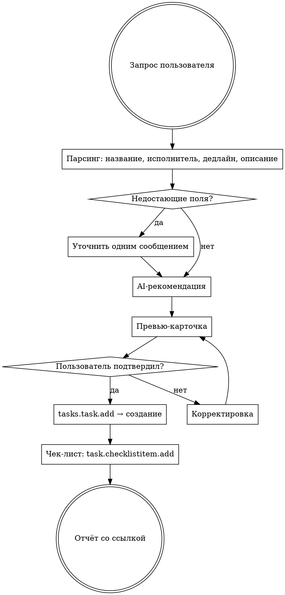

# Постановка задач в Битрикс24 — Wookiee / TELOWAY

Скилл формулирует задачу по правилам компании и создаёт её в Битрикс24 через REST API после подтверждения пользователя.

### Tool Logging

```bash
PYTHONPATH=. python3 -c "
from shared.tool_logger import ToolLogger
logger = ToolLogger('/bitrix-task')
run_id = logger.start(trigger='manual', user='danila')
print(f'RUN_ID={run_id}')
"
```

At end: `logger.finish(RUN_ID, status='success', details={'task_title': '...', 'assignee': '...'})`

## Делегирование Sonnet (экономия токенов)

Этот скилл использует двухфазный подход для экономии Opus-токенов:

**Фаза A — Парсинг и превью (Sonnet):**
Запусти `Agent(model: "sonnet")` с промптом, содержащим:
- Запрос пользователя (дословно)
- Все инструкции ниже: шаги 1-4, справочник команды, правила формулировки, маппинг полей, дефолты
- Текущую дату (результат `date`)
- Задача субагента: распарсить запрос, подготовить превью-карточку, вернуть: (1) превью-карточку для показа пользователю, (2) список недостающих полей если есть, (3) готовый JSON для API-вызова

**Фаза B — Подтверждение и создание (основная модель):**
1. Покажи превью/вопросы от субагента пользователю
2. Если пользователь подтвердил — выполни curl из Шага 5 с готовым JSON
3. Если правки — запусти нового Sonnet-субагента с обновлённым запросом
4. Покажи результат (Шаг 7)

## Флоу



## Шаг 1: Парсинг запроса

Из сообщения пользователя извлечь:
- **Название** — короткое, с глагола, макс 80 символов
- **Исполнитель** — fuzzy-match по имени из справочника команды
- **Дедлайн** — абсолютный или относительный ("завтра", "до конца недели"). Узнать текущую дату: `date`
- **Описание** — что нужно сделать, контекст
- **Чек-лист** — если упомянуты шаги
- **Наблюдатели / Соисполнители** — если упомянуты
- **Приоритет** — "срочно" / "важно" = высокий; по умолчанию обычный

### Обработка голосового ввода

Текст может быть сырым — с повторами, оговорками, нечёткими именами. Правила:
- Убирать дубли (текст может повториться дословно)
- Бренды: «Шарлопе» = Charlotte, «Свинде» = Wendy, «Тиловые/Теловый» = TELOWAY, «Эрик/Сингвер» = Эрик (Singwear), «БГ» = фабрика БГ
- Имена: «девочки» = Алина Сотникова + Лилия Зайнутдинова (если контекст про закупки), «Полька» = Полина, «Лера» = Валерия Матвеева
- Не переспрашивать очевидное — интерпретировать по контексту

## Шаг 2: Уточнение

Обязательные поля — без них задача НЕ создаётся:
- Название
- Исполнитель (конкретный человек)
- Дедлайн
- Ожидаемый результат

Если чего-то нет — спросить **одним сообщением** все недостающие пункты.

**НЕ додумывай:**
- Конкретные цифры, даты, суммы — если не названы, спроси
- Детали, которые пользователь не упомянул
- Дополнительные подзадачи, которые не следуют из контекста

**Можно дополнить:**
- Структуру описания (разбить на пункты)
- Формулировку результата, если она очевидна из контекста
- Предложить дедлайн, если не указан (но пометить «предложение»)

## Шаг 3: AI-рекомендация

**Обязательно для каждой задачи** — оценить, можно ли часть работы сделать с AI. Если да — добавить в превью.

Примеры:
- Анализ данных → «Claude / ChatGPT для первичного анализа таблицы»
- Сбор информации → «AI-ресёрч через Claude / Perplexity»
- Написание текста → «Черновик через AI, затем редактура»
- Работа с таблицами → «Формулы через Claude Code / Code Interpreter»
- Рутинные проверки → «Чек-лист проверки через AI»

Если задача чисто физическая — пропустить этот блок.

## Шаг 4: Превью-карточка

Показать пользователю и спросить подтверждение:

```
Задача:         [название]
Ответственный:  [Имя Фамилия] (ID: XX)
Постановщик:    Данила Матвеев (ID: 1)
Соисполнители:  [имена] или —
Наблюдатели:    [имена] или —
Дедлайн:        [ДД месяца ЧЧ:ММ, день недели]
Приоритет:      Обычный / Высокий / Низкий

Описание:
[полный текст описания]

Чек-лист:
☐ пункт 1
☐ пункт 2

AI-подсказка:   [рекомендация]

Всё верно? Хочешь что-то изменить?
```

### Умные подсказки

По теме задачи предложить дополнительных участников:

| Тема | Предложить |
|------|-----------|
| Финансы, P&L, бюджет | Артем Колчин; бухгалтерия → + Галия Талипова |
| Продукт, ассортимент, закупки | Полина Медведева, Лилия Зайнутдинова; Китай → + Алина Сотникова |
| Маркетинг, реклама | Светлана Корабец |
| SMM, контент-план, соцсети | Мария Делова |
| Блогеры, influence | Валерия Матвеева |
| Контент, фото, видео | Алина Кантеева |
| Склад, логистика, отгрузки | Дмитрий Дрозд, Евгения Сек |
| Маркетплейсы, карточки, WB, Ozon | Анастасия Лигус |
| HR, найм | Александра Леховицкая |

После выдачи превью, если уместно, коротко предложить:
- Кого добавить в наблюдатели
- Связать с другой задачей
- Что пользователь мог не учесть (только если реально важно)

## Шаг 5: Создание задачи

После подтверждения пользователя — вызов API:

```bash
curl -s "https://wookiee.bitrix24.ru/rest/1/pi0f0di5epbkivs6/tasks.task.add.json" \
  -H "Content-Type: application/json" \
  -d '{
    "fields": {
      "TITLE": "Название задачи",
      "RESPONSIBLE_ID": 25,
      "CREATED_BY": 1,
      "DESCRIPTION": "Полное описание задачи.\n\nОжидаемый результат: ...",
      "DEADLINE": "2026-04-01T18:00:00",
      "PRIORITY": 1,
      "AUDITORS": [1],
      "ACCOMPLICES": []
    }
  }'
```

Из ответа получить ID задачи: поле `result.task.id`.

При ошибке — показать текст ошибки пользователю, не повторять автоматически.

## Шаг 6: Чек-лист

Если есть пункты чек-листа — добавить каждый отдельным вызовом после создания задачи:

```bash
curl -s "https://wookiee.bitrix24.ru/rest/1/pi0f0di5epbkivs6/task.checklistitem.add.json" \
  -H "Content-Type: application/json" \
  -d '{
    "TASKID": TASK_ID,
    "FIELDS": {
      "TITLE": "Текст пункта чек-листа"
    }
  }'
```

## Шаг 7: Отчёт

После успешного создания:

```
Задача создана: [TITLE]
Ссылка: https://wookiee.bitrix24.ru/workgroups/group/0/tasks/task/view/{TASK_ID}/
Чек-лист: добавлено X пунктов
```

Если пользователь попросил что-то поменять после создания — использовать `tasks.task.update`:

```bash
curl -s "https://wookiee.bitrix24.ru/rest/1/pi0f0di5epbkivs6/tasks.task.update.json" \
  -H "Content-Type: application/json" \
  -d '{
    "taskId": TASK_ID,
    "fields": {
      "ПОЛЕ": "новое значение"
    }
  }'
```

## Справочник команды Bitrix24

| Bitrix ID | Имя | Роль | Зона |
|-----------|-----|------|------|
| 1 | Данила Матвеев | CEO | Всё |
| 11 | Валерия Матвеева | Бизнес-ассистент, influence | Influence, офис, финансы |
| 13 | Евгения Сек | Менеджер склада и проверки качества | Склад |
| 17 | Дмитрий Дрозд | Руководитель склада / менеджер закупки | Склад, логистика |
| 19 | Мария Делова | Проджект SMM | SMM |
| 25 | Полина Медведева | Директор по продукту | Продукт |
| 41 | Светлана Корабец | Менеджер по рекламе | Маркетинг, реклама |
| 555 | Алина Кантеева | Контент-менеджер | Контент |
| 707 | Татьяна Матвеева | Менеджер склада, сборщик | Склад |
| 839 | Александра Леховицкая | HR-консультант (подряд) | HR |
| 1057 | Анастасия Лигус | Менеджер маркетплейсов | Маркетплейсы |
| 1315 | Галия Талипова | Бухгалтер (подряд) | Финансы |
| 1435 | Артем Колчин | Финансовый менеджер | Финансы, аналитика |
| 1625 | Алина Сотникова | Категорийный менеджер, закупки в Китае | Продукт, закупки |
| 2223 | Лилия Зайнутдинова | Менеджер продукта | Продукт |
| 2349 | Елизавета Литвинова | Исполнительный директор | Управление |

### Подрядчики (не в Битриксе, задачи ставить через сотрудников)

| Имя / компания | Сфера |
|---------------|-------|
| Галия Гаяновна | Бухгалтерия, налоги, банки |
| Scale-O | Юридическое сопровождение |
| Михаил (аутсорс) | Excel-таблицы, сложная аналитика |

**Если пользователь называет имя, которого нет в справочнике — спросить, не додумывать.**

### Обновление справочника

```bash
curl -s "https://wookiee.bitrix24.ru/rest/1/pi0f0di5epbkivs6/user.get.json" \
  --data-urlencode 'ACTIVE=true' | python3 -c "
import json, sys
data = json.load(sys.stdin)
for u in data.get('result', []):
    if not u.get('ACTIVE'): continue
    print(f\"ID={u['ID']} | {u.get('NAME','')} {u.get('LAST_NAME','')} | {u.get('WORK_POSITION','')}\")
"
```

## Маппинг полей

| Поле скилла | API field | Тип | Обязательное |
|-------------|-----------|-----|-------------|
| Название | TITLE | string | да |
| Исполнитель | RESPONSIBLE_ID | int | да |
| Постановщик | CREATED_BY | int (всегда 1) | да |
| Описание | DESCRIPTION | string | да |
| Дедлайн | DEADLINE | datetime (YYYY-MM-DDTHH:MM:SS) | да |
| Приоритет | PRIORITY | int: 0=низкий, 1=обычный, 2=высокий | нет (дефолт: 1) |
| Наблюдатели | AUDITORS | array[int] | нет |
| Соисполнители | ACCOMPLICES | array[int] | нет |
| Проект | GROUP_ID | int | нет |

## Дефолты

- **Постановщик**: Данила Матвеев (ID=1) — всегда
- **Приоритет**: 1 (обычный) — если не указано иное
- **Время дедлайна**: 18:00 по Москве — если указана только дата
- **Наблюдатели**: пусто — если не указано
- **Соисполнители**: пусто — если не указано

## Правила формулировки

### Название
- Начинается с глагола: «Узнать», «Подготовить», «Собрать», «Связаться», «Проанализировать»
- Конкретное: «Узнать условия ФБС у 5 фулфилментов» — хорошо. «Задача по фулфилментам» — плохо
- Не длиннее ~80 символов

### Описание
- Первая строка — обращение к исполнителю по имени + суть
- Далее — нумерованный список действий
- Никакой воды, вступлений, мотивационных фраз
- Ссылки на документы — вставить явно
- Если список контрагентов / позиций — перечислить, не «все из таблицы»

### Чек-лист
- Для задач с 3+ шагами
- Каждый пункт — конкретное действие, которое можно отметить «сделано»

### Результат
- Конкретный артефакт: «Заполненная Google Таблица с...», «Ответ в чат задачи с...»
- Если нужен вывод — «+ короткий вывод: кто лучше / дешевле»

### Дедлайн
- Формат: «25 марта 18:00» (в карточке) → `2026-03-25T18:00:00` (в API)
- «До конца недели» → пересчитать в пятницу 18:00
- Если не указан — предложить, пометить «(предложение)»

### Проект
- WOOKIEE, TELOWAY или «Общее» — указывать в описании
- Если непонятно — спросить

## Принципы

1. **Ёмко, понятно, только по делу.** Задача — не эссе.
2. **Нет додумыванию.** Если данных нет — спросить.
3. **Один исполнитель.** Не «команда», не «отдел». Конкретный человек.
4. **Результат обязателен.** Без целевого результата задача не создаётся.
5. **AI-first.** Всегда думай: что из этой задачи можно ускорить через AI.
6. **Полная версия после правок.** Если пользователь поменял что-то — показать обновлённую карточку целиком.
7. **Подтверждение перед созданием.** Всегда показать превью и дождаться «да» перед вызовом API.

## Контекст брендов

- **Wookiee** — бренд женского белья, ~400 млн/год, WB+Ozon
- **TELOWAY** — wellness-бренд спортивной одежды (запуск 2026). Поглощает Wookiee
- Оба бренда = одна компания, один Битрикс, одна команда

---

## Логирование (выполнить после создания задачи)

Прочитай `USER_EMAIL` из `.env`. Выполни через Supabase MCP (`execute_sql`, project `gjvwcdtfglupewcwzfhw`):

```sql
WITH ins AS (
  INSERT INTO tool_runs (
    id, tool_slug, status, trigger_type, triggered_by,
    items_processed, notes,
    started_at, finished_at, duration_sec
  ) VALUES (
    gen_random_uuid(), '/bitrix-task',
    '{status}', 'manual', 'user:{USER_EMAIL}',
    1, 'task_id={task_id}',
    now() - interval '{duration_sec} seconds', now(), {duration_sec}
  ) RETURNING tool_slug
)
UPDATE tools SET
  total_runs = total_runs + 1,
  last_run_at = now(),
  last_status = '{status}',
  updated_at = now()
WHERE slug = '/bitrix-task';
```

Где: `{status}` = `success` или `error`, `{task_id}` = ID созданной задачи в Битрикс, `{USER_EMAIL}` из `.env`, `{duration_sec}` = секунды.
