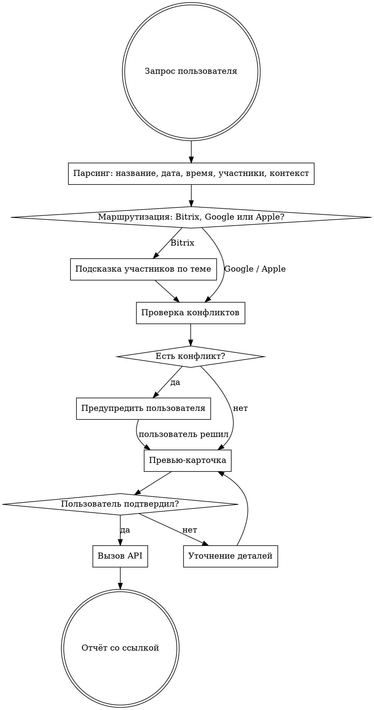

# Calendar — создание событий

Скилл помогает создавать события в Google Calendar, Bitrix24, Yandex Calendar и Apple Calendar. Ведёт пользователя через уточнение деталей, проверяет конфликты, показывает превью, создаёт после подтверждения.

## Делегирование Sonnet (экономия токенов)

Двухфазный подход:

**Фаза A — Парсинг, маршрутизация, проверка конфликтов (Sonnet):**
Запусти `Agent(model: "sonnet")` с промптом, содержащим:
- Запрос пользователя (дословно)
- Все инструкции ниже: шаги 1-5, справочник команды, Calendar IDs, таймзоны, дефолты, API-команды проверки
- Текущую дату (результат `date`)
- Задача субагента: распарсить запрос, определить календарь, проверить конфликты через API, подготовить превью-карточку. Вернуть: (1) превью-карточку с обеими таймзонами, (2) найденные конфликты (если есть), (3) готовый API-запрос для создания события, (4) список недостающих полей (если есть).

**Фаза B — Подтверждение и создание (основная модель):**
1. Покажи превью/конфликты/вопросы от субагента пользователю
2. Если подтвердил — выполни готовый API-запрос из Шага 6
3. Если правки — запусти нового Sonnet-субагента с обновлёнными данными
4. Покажи результат

## Флоу



## Шаг 1: Парсинг запроса

Из сообщения извлечь:
- **Название** — краткое, понятное
- **Дата и время** — абсолютные или относительные ("завтра", "в пятницу"). Узнать текущую дату командой `date`
- **Таймзона** — по умолчанию `America/Sao_Paulo` (Бразилия); если сказано "по Москве" / "МСК" → `Europe/Moscow`
- **Участники** — fuzzy-match по имени из справочника ниже
- **Контекст** — рабочее или личное (определяет календарь)
- **Описание** — если указано

Если чего-то не хватает — спросить. Не угадывать критичные параметры (дату, время).

## Шаг 2: Маршрутизация

| Сигнал | Календарь | Метод |
|--------|-----------|-------|
| Упомянуты сотрудники, Wookiee, TELOWAY, рабочее, созвон с командой | **Bitrix24** | `calendar.event.add` |
| Личное, спорт, обучение, врач, тренировка | **Google "Данила Личное"** | `gws calendar events insert` с calendarId личного |
| Всё остальное | **Google "Данила Основной"** | `gws calendar events insert` с primary |

| Яндекс-календарь, Yandex, телемост (если не Bitrix), события для matveev@wookiee.shop | **Yandex Calendar** | CalDAV PUT |
| Семейное, дети, жена, совместные планы, семья | **Apple "Семейный календарь"** | `osascript` (Apple Calendar) |

## Шаг 3: Подсказка участников

Если событие рабочее и тема подразумевает конкретных людей — предложить:

| Тема | Предложить |
|------|-----------|
| Финансы, P&L, бюджет | Артем Колчин; бухгалтерия → + Галия Талипова |
| Продукт, ассортимент, модели | Полина Медведева, Лилия Зайнутдинова; закупки Китай → + Алина Сотникова |
| Маркетинг, реклама, перформанс | Светлана Корабец |
| SMM, соцсети | Мария Делова |
| Блогеры, influence, амбассадоры | Валерия Матвеева |
| Контент, фото, видео | Алина Кантеева |
| Склад, логистика, качество | Дмитрий Дрозд, Евгения Сек |
| Маркетплейсы, карточки, WB, Ozon | Анастасия Лигус |
| HR, найм | Александра Леховицкая |

## Шаг 4: Проверка конфликтов (ОБЯЗАТЕЛЬНО)

**Перед показом превью** — проверить ВСЕ календари на пересечения с запрашиваемым временем. Проверять в обеих таймзонах (событие в 15:00 МСК = 09:00 Сан-Паулу, конфликт может быть в любом календаре).

### Какие календари проверять

1. **Bitrix24** — `calendar.event.get` за нужную дату
2. **Google "Данила Основной"** — `gws calendar events list` с primary
3. **Google "Данила Личное"** — `gws calendar events list` с calendarId личного
4. **Google "Wookiee Данила"** — `gws calendar events list` (sync с Bitrix, но проверить для полноты)
5. **Apple "Семейный календарь"** — `osascript` листинг событий за день
6. **Yandex Calendar** — CalDAV REPORT за нужную дату

### Если найден конфликт

Показать пользователю ВСЕ пересекающиеся события:

```
⚠️ На это время уже есть события:

• 15:00–15:30 МСК (09:00–09:30 Сан-Паулу) — «Созвон с Полиной» (Bitrix24)
• 15:00–16:00 МСК (09:00–10:00 Сан-Паулу) — «Тренировка» (Google Личное)

Варианты:
1. Поставить всё равно (будет наложение)
2. Сдвинуть на другое время — предложи удобное
3. Перенести/удалить существующее событие

Что делаем?
```

**НЕ создавать событие с наложением без явного подтверждения пользователя.** Если пользователь сказал «поставь» — всё равно показать конфликт и спросить. Только после фразы типа «да, ставь, наложение ок» / «пусть будет два» — создавать.

### Команды проверки

```bash
# Bitrix24 — события за день
curl -s "https://wookiee.bitrix24.ru/rest/1/pi0f0di5epbkivs6/calendar.event.get.json" \
  --data-urlencode 'type=user' \
  --data-urlencode 'ownerId=1' \
  --data-urlencode 'from=YYYY-MM-DD' \
  --data-urlencode 'to=YYYY-MM-DD'

# Google — события за день (для каждого calendarId)
gws calendar events list \
  --params '{"calendarId": "CALENDAR_ID", "timeMin": "YYYY-MM-DDT00:00:00Z", "timeMax": "YYYY-MM-DDT23:59:59Z", "singleEvents": true, "orderBy": "startTime"}'

# Yandex Calendar — события за день
curl -s -X REPORT \
  -H "Authorization: OAuth ${YANDEX_OAUTH_TOKEN}" \
  -H "Content-Type: application/xml" \
  -H "Depth: 1" \
  -d '<?xml version="1.0" encoding="UTF-8"?>
<C:calendar-query xmlns:D="DAV:" xmlns:C="urn:ietf:params:xml:ns:caldav">
  <D:prop>
    <D:getetag/>
    <C:calendar-data/>
  </D:prop>
  <C:filter>
    <C:comp-filter name="VCALENDAR">
      <C:comp-filter name="VEVENT">
        <C:time-range start="YYYYMMDDT000000Z" end="YYYYMMDDT235959Z"/>
      </C:comp-filter>
    </C:comp-filter>
  </C:filter>
</C:calendar-query>' \
  "https://caldav.yandex.ru/calendars/matveev%40wookiee.shop/events-default/"

# Apple — события за день
osascript <<'SCRIPT'
tell application "Calendar"
    set familyCal to first calendar whose name is "Семейный календарь"
    set dayStart to current date
    set year of dayStart to YYYY
    set month of dayStart to MM
    set day of dayStart to DD
    set hours of dayStart to 0
    set minutes of dayStart to 0
    set seconds of dayStart to 0
    set dayEnd to dayStart + (1 * days)
    set dayEvents to (every event of familyCal whose start date ≥ dayStart and start date < dayEnd)
    set result to ""
    repeat with e in dayEvents
        set result to result & summary of e & " | " & (start date of e as string) & " - " & (end date of e as string) & return
    end repeat
    return result
end tell
SCRIPT
```

## Шаг 5: Превью-карточка

Показать и спросить подтверждение:

```
Событие:        [название]
Календарь:      [Bitrix24 / Yandex Calendar / Google "Данила Личное" / Google "Данила Основной" / Apple "Семейный календарь"]
Дата:           [дата, день недели]
Время:          [HH:MM МСК] ([HH:MM Сан-Паулу])
Длительность:   [длительность]
Участники:      [список с должностями]
Описание:       [текст или "—"]

Всё верно? Хочешь что-то изменить?
```

**Всегда показывать время в обеих зонах** (МСК и Сан-Паулу).

## Шаг 6: Создание

После подтверждения — вызов API. Показать результат.

## Дефолты

- **Длительность**: 60 мин (1 час)
- **Таймзона**: `America/Sao_Paulo` (если не указано иное)
- **Напоминание**: 15 мин до
- **Организатор**: Данила Матвеев (Bitrix ID=1)
- **Ссылка на созвон (Bitrix)**: всегда добавлять в `location` постоянную ссылку на Яндекс Телемост: `https://telemost.360.yandex.ru/j/63944462843605`. Одна ссылка на все рабочие встречи.

## Справочник команды Bitrix24

Последнее обновление: март 2026. Для актуализации: см. секцию "Обновление справочника" ниже.

| ID | Имя | Должность | Зона |
|----|-----|-----------|------|
| 1 | Данила Матвеев | Генеральный директор | Всё |
| 11 | Валерия Матвеева | Офис-менеджер, influence-маркетолог | Influence, офис |
| 13 | Евгения Сек | Менеджер склада и качества | Склад |
| 17 | Дмитрий Дрозд | Руководитель склада / закупки | Склад |
| 19 | Мария Делова | Проджект SMM | SMM |
| 25 | Полина Медведева | Директор по продукту | Продукт |
| 41 | Светлана Корабец | Менеджер по рекламе (МП + внешняя) | Реклама |
| 555 | Алина Кантеева | Контент-менеджер | Контент |
| 707 | Татьяна Матвеева | Менеджер склада, сборщик | Склад |
| 839 | Александра Леховицкая | HR-консультант (подряд) | HR |
| 1057 | Анастасия Лигус | Менеджер маркетплейсов | МП |
| 1315 | Галия Талипова | Бухгалтер (подряд) | Финансы |
| 1435 | Артем Колчин | Финансовый менеджер | Финансы |
| 1625 | Алина Сотникова | Категорийный менеджер, закупки Китай | Продукт |
| 2223 | Лилия Зайнутдинова | Менеджер продукта | Продукт |

## Календари Google

| Название | Calendar ID | Запись |
|----------|------------|-------|
| Данила Основной (primary) | `matveev.liceist@gmail.com` | да |
| Данила Личное | `bc8f10ff8a39dad0822ec1c8839e75774986f968c8c603916dfea1512e0c2833@group.calendar.google.com` | да |
| Wookiee Данила | `236f96609261a46a41d003e12769edcc6cc385a4522760aa1e172b74f264ed5b@group.calendar.google.com` | не писать (sync с Bitrix) |
| Yandex Calendar | `matveev@wookiee.shop` (CalDAV) | да |
| Семейный | iCloud (через `osascript`) | да (Apple Calendar, shared by Polina Medvedeva) |

## API: Bitrix24

Базовый URL: `https://wookiee.bitrix24.ru/rest/1/pi0f0di5epbkivs6/`

### Создание события

```bash
curl -s "${BITRIX_URL}calendar.event.add.json" \
  -H "Content-Type: application/json" \
  -d '{
    "type": "user",
    "ownerId": 1,
    "name": "НАЗВАНИЕ",
    "description": "ОПИСАНИЕ",
    "from": "YYYY-MM-DD HH:MM:00",
    "to": "YYYY-MM-DD HH:MM:00",
    "timezone": "America/Sao_Paulo",
    "location": "https://telemost.360.yandex.ru/j/63944462843605",
    "section": 5,
    "is_meeting": "Y",
    "attendees": [1, USER_ID],
    "importance": "normal",
    "remind": [{"type": "min", "count": 15}]
  }'
```

Где `BITRIX_URL=https://wookiee.bitrix24.ru/rest/1/pi0f0di5epbkivs6/`

**ВАЖНО**: Битрикс у Данилы отображает события в `America/Sao_Paulo` (UTC-3). Всегда передавать время и timezone в Сан-Паулу. Если пользователь называет время "по Москве" — пересчитать в Сан-Паулу (МСК - 6ч) и передать São Paulo время. Например: 14:00 МСК = 08:00 Сан-Паулу → `"from": "YYYY-MM-DD 08:00:00"`, `"timezone": "America/Sao_Paulo"`.

Время в Bitrix передавать в **той таймзоне, которая указана в поле timezone**. Section `5` — основной календарь Данилы.

### Получение событий (для проверки)

```bash
curl -s "${BITRIX_URL}calendar.event.get.json" \
  --data-urlencode 'type=user' \
  --data-urlencode 'ownerId=1' \
  --data-urlencode 'from=YYYY-MM-DD' \
  --data-urlencode 'to=YYYY-MM-DD'
```

## API: Google Calendar

### Создание события

```bash
gws calendar events insert \
  --params '{"calendarId": "CALENDAR_ID"}' \
  --json '{
    "summary": "НАЗВАНИЕ",
    "description": "ОПИСАНИЕ",
    "start": {"dateTime": "YYYY-MM-DDTHH:MM:00-03:00", "timeZone": "America/Sao_Paulo"},
    "end": {"dateTime": "YYYY-MM-DDTHH:MM:00-03:00", "timeZone": "America/Sao_Paulo"},
    "reminders": {"useDefault": false, "overrides": [{"method": "popup", "minutes": 15}]}
  }'
```

Для событий "по Москве" — пересчитать в Сан-Паулу (МСК - 6ч) и использовать `-03:00` и `"timeZone": "America/Sao_Paulo"`. Никогда не использовать `Europe/Moscow` в calendar.event.add — Битрикс отображает всё в São Paulo.

### Получение событий (для проверки)

```bash
gws calendar events list \
  --params '{"calendarId": "CALENDAR_ID", "timeMin": "YYYY-MM-DDT00:00:00Z", "timeMax": "YYYY-MM-DDT23:59:59Z", "singleEvents": true, "orderBy": "startTime"}'
```

## API: Apple Calendar (Семейный)

Доступ через `osascript` (AppleScript). Работает только на Mac, где открыт Apple Calendar.

### Создание события

**ВАЖНО**: Не использовать `date "строка"` — формат AM/PM не работает на Mac с 24-часовым форматом. Вместо этого собирать дату программно:

```bash
osascript <<'EOF'
tell application "Calendar"
    set familyCal to first calendar whose name is "Семейный календарь"

    set startDate to current date
    set year of startDate to YYYY
    set month of startDate to MM
    set day of startDate to DD
    set hours of startDate to HH  -- 24-часовой формат (18 = 6 PM)
    set minutes of startDate to MM
    set seconds of startDate to 0

    set endDate to current date
    set year of endDate to YYYY
    set month of endDate to MM
    set day of endDate to DD
    set hours of endDate to HH
    set minutes of endDate to MM
    set seconds of endDate to 0

    set newEvent to make new event at end of events of familyCal with properties {summary:"НАЗВАНИЕ", start date:startDate, end date:endDate, description:"ОПИСАНИЕ"}
    return uid of newEvent
end tell
EOF
```

Время задавать в **24-часовом формате** (18 = 6 вечера, 9 = 9 утра). Таймзона — локальная (America/Sao_Paulo на Mac Данилы).

### Удаление события

```bash
osascript -e '
tell application "Calendar"
    set familyCal to first calendar whose name is "Семейный календарь"
    set targetEvents to (every event of familyCal whose summary is "НАЗВАНИЕ")
    repeat with e in targetEvents
        delete e
    end repeat
end tell'
```

## API: Yandex Calendar (CalDAV)

CalDAV endpoint: `https://caldav.yandex.ru/calendars/matveev%40wookiee.shop/events-default/`
Авторизация: `Authorization: OAuth ${YANDEX_OAUTH_TOKEN}`

### Создание события

```bash
EVENT_UID=$(python3 -c "import uuid; print(uuid.uuid4())")
curl -s -X PUT \
  -H "Authorization: OAuth ${YANDEX_OAUTH_TOKEN}" \
  -H "Content-Type: text/calendar" \
  -d "BEGIN:VCALENDAR
VERSION:2.0
PRODID:-//Claude Code//Matveev OS//EN
BEGIN:VEVENT
UID:${EVENT_UID}
DTSTART;TZID=America/Sao_Paulo:YYYYMMDDTHHMMSS
DTEND;TZID=America/Sao_Paulo:YYYYMMDDTHHMMSS
SUMMARY:НАЗВАНИЕ
DESCRIPTION:ОПИСАНИЕ
END:VEVENT
END:VCALENDAR" \
  "https://caldav.yandex.ru/calendars/matveev%40wookiee.shop/events-default/${EVENT_UID}.ics"
```

**ВАЖНО**:
- Каждое событие требует уникальный UID (генерировать через `uuid.uuid4()`)
- URL события = endpoint + `{UID}.ics`
- Время передавать с `TZID=America/Sao_Paulo` (аналогично другим календарям)
- Если пользователь назвал время "по Москве" — пересчитать в Сан-Паулу (МСК - 6ч)
- Формат даты в iCalendar: `YYYYMMDDTHHMMSS` (без дефисов и двоеточий)
- Целодневное событие: `DTSTART;VALUE=DATE:YYYYMMDD` и `DTEND;VALUE=DATE:YYYYMMDD` (следующий день)
- Успешный PUT возвращает HTTP 201 Created
- При ошибке 401 — токен истёк, нужно заново пройти OAuth flow

### Если токен истёк (401)

1. Открыть: `https://oauth.yandex.ru/authorize?response_type=code&client_id=2d8c5155e6384a929c2e57f71a3126f0`
2. Войти как `matveev@wookiee.shop`
3. Скопировать код верификации
4. Обменять на токен:
   ```bash
   curl -X POST https://oauth.yandex.ru/token \
     -d "grant_type=authorization_code&code=ВСТАВИТЬ_КОД&client_id=2d8c5155e6384a929c2e57f71a3126f0&client_secret=ee5aac390b4348528dfbbbd710b7a646"
   ```
5. Обновить `YANDEX_OAUTH_TOKEN` в окружении

## Таймзоны

- **Данила**: Флорианополис, Бразилия — `America/Sao_Paulo` (UTC-3)
- **Команда**: Москва — `Europe/Moscow` (UTC+3)
- **Разница**: 6 часов (Москва впереди)
- Время без уточнения → Сан-Паулу
- "по Москве" / "МСК" → Москва
- Превью всегда показывает оба времени

## Обновление справочника команды

```bash
curl -s "https://wookiee.bitrix24.ru/rest/1/pi0f0di5epbkivs6/user.get.json" \
  --data-urlencode 'ACTIVE=true' | python3 -c "
import json, sys
data = json.load(sys.stdin)
for u in data.get('result', []):
    if not u.get('ACTIVE'): continue
    print(f\"ID={u['ID']} | {u.get('NAME','')} {u.get('LAST_NAME','')} | {u.get('WORK_POSITION','')}\")
"
```

Исключить из справочника: Пустой Аккаунт (719), Дарина Сапронова (51), Salmon IT (699), Артём Портнов (61), Виктор Чебан (463).
