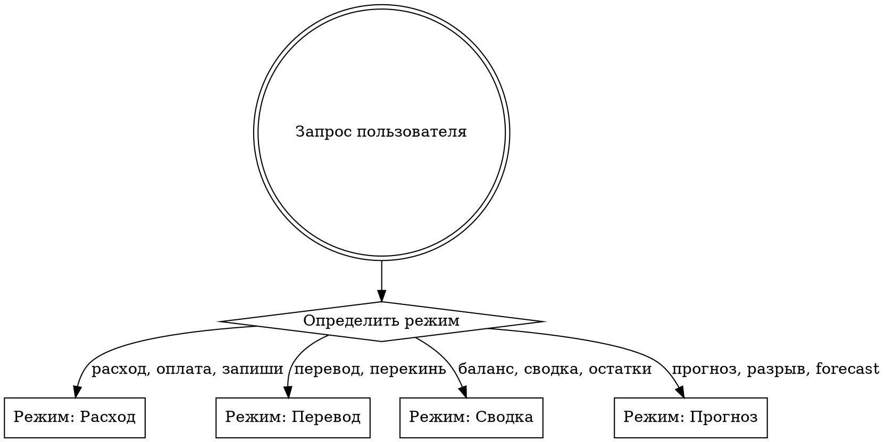
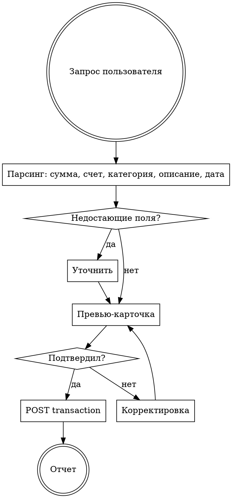

# Финолог — управление ДДС

Скилл для работы с движением денежных средств через Finolog API. Четыре режима: запись расходов, переводы между счетами, сводка по балансам, прогноз кассового разрыва.

### Tool Logging

```bash
PYTHONPATH=. python3 -c "
from shared.tool_logger import ToolLogger
logger = ToolLogger('/finolog')
run_id = logger.start(trigger='manual', user='danila')
print(f'RUN_ID={run_id}')
"
```

At end: `logger.finish(RUN_ID, status='success', details={'action': 'расход/перевод/сводка/прогноз'})`

## Делегирование Sonnet (экономия токенов)

**Режимы «Сводка» и «Прогноз» (только чтение):**
Делегируй ВСЮ работу `Agent(model: "sonnet")` — субагент выполняет API-запросы, форматирует вывод и возвращает готовый результат. Покажи его пользователю без изменений.

**Режимы «Расход» и «Перевод» (запись, нужно подтверждение):**
Двухфазный подход:
- **Фаза A (Sonnet):** Запусти `Agent(model: "sonnet")` для парсинга запроса, fuzzy-match счетов/категорий и генерации превью-карточки. Передай субагенту: запрос пользователя, справочники счетов и категорий, текущую дату. Субагент возвращает: превью-карточку + готовый curl-запрос + список недостающих полей (если есть).
- **Фаза B (основная модель):** Покажи превью пользователю. После подтверждения — выполни готовый curl. Если правки — запусти нового Sonnet-субагента с обновлёнными данными.

## Маршрутизация



## API

- **Base URL**: `https://api.finolog.ru/v1`
- **Бизнес**: `biz_id = 48556` (Wookiee)
- **Аутентификация**: заголовок `Api-Token: ${FINOLOG_API_KEY}` (ключ из `.env`)
- **Параметры**: передаются как **query params** (не JSON body)

---

# Режим 1: Расход

## Флоу



### Шаг 1: Парсинг запроса

Из сообщения извлечь:
- **Сумма** — обязательно. «50 тысяч» = 50000, «150к» = 150000
- **Счет** — fuzzy-match по справочнику. «с ООО» → уточнить какой (Точка / Сбербанк / Совкомбанк / ВТБ). «с ИП» → аналогично
- **Категория ДДС** — fuzzy-match по справочнику. «закупка товара» → Закупка товара (980563)
- **Описание** — если указано
- **Дата** — абсолютная или относительная. По умолчанию — сегодня. Узнать текущую дату: `date`

### Обработка голосового ввода

- Убирать дубли (текст может повториться)
- «тысяч» / «тыщ» / «к» = ×1000
- «лям» / «миллион» = ×1000000
- «Точка ООО» / «ООО Точка» = ООО Вуки Точка ₽
- «Тинькофф ИП» / «ИП Тинькофф» = ИП Полина Тинькофф ₽
- «налоги» (как счет) = Фонд Налоги
- «ФОТ» (как счет) = Фонд оплаты труда
- Не переспрашивать очевидное — интерпретировать по контексту

### Шаг 2: Уточнение

Обязательные поля — без них операция НЕ создаётся:
- Сумма
- Счет списания
- Категория ДДС

Если чего-то нет или неоднозначно — спросить **одним сообщением** все недостающие пункты. При неоднозначности счета — предложить варианты.

### Шаг 3: Превью-карточка

```
Расход:        [сумма] ₽
Счет:          [название счета]
Категория:     [название категории]
Дата:          [ДД месяца ГГГГ, день недели]
Описание:      [текст или "—"]
Статус:        Факт

Всё верно? Хочешь что-то изменить?
```

### Шаг 4: Создание

```bash
curl -s "https://api.finolog.ru/v1/biz/48556/transaction" \
  -H "Api-Token: ${FINOLOG_API_KEY}" \
  -X POST \
  -d "date=YYYY-MM-DD 00:00:00" \
  -d "from_id=ACCOUNT_ID" \
  -d "value=СУММА" \
  -d "category_id=CATEGORY_ID" \
  -d "description=ОПИСАНИЕ" \
  -d "status=regular"
```

### Шаг 5: Отчёт

```
Записано: расход [СУММА] ₽
Счет: [название]
Категория: [категория]
Дата: [дата]
ID операции: [id из ответа]
```

При ошибке — показать текст ошибки, не повторять автоматически.

---

# Режим 2: Перевод между счетами

### Парсинг

- **Сумма** — обязательно
- **Счет-источник** (from) — fuzzy-match
- **Счет-получатель** (to) — fuzzy-match
- **Дата** — по умолчанию сегодня

Категория при переводе автоматически: «Перевод между счетами» (ID=1).

### Превью-карточка

```
Перевод:       [сумма] ₽
Откуда:        [счет-источник]
Куда:          [счет-получатель]
Дата:          [ДД месяца ГГГГ, день недели]
Статус:        Факт

Всё верно?
```

### Создание

```bash
curl -s "https://api.finolog.ru/v1/biz/48556/transaction" \
  -H "Api-Token: ${FINOLOG_API_KEY}" \
  -X POST \
  -d "date=YYYY-MM-DD 00:00:00" \
  -d "from_id=FROM_ACCOUNT_ID" \
  -d "to_id=TO_ACCOUNT_ID" \
  -d "from_value=СУММА" \
  -d "to_value=СУММА" \
  -d "status=regular"
```

Если счета в разных валютах — `from_value` и `to_value` могут отличаться, уточнить у пользователя.

---

# Режим 3: Сводка по счетам

Пользователь просит: «покажи балансы», «сводка по счетам», «сколько на счетах».

### Получение данных

**ВАЖНО**: обязательно использовать параметр `?with=summary` — без него балансы НЕ возвращаются.

```bash
curl -s "https://api.finolog.ru/v1/biz/48556/account?with=summary" \
  -H "Api-Token: ${FINOLOG_API_KEY}"
```

Каждый счёт будет содержать:
- `summary[].balance` (type=regular) — фактический баланс
- `planned_summary[].balance` (type=planned) — баланс с учётом плановых

Использовать **`summary` с type=regular`** для показа текущих остатков.

### Формат вывода

Сгруппировать по типу (расчётные счета, фонды, валютные):

```
Расчётные счета (₽):
  ООО Вуки Точка           1 200 000 ₽
  ИП Полина Точка             850 000 ₽
  ИП Полина Тинькофф          320 000 ₽
  ООО Вуки Сбербанк           150 000 ₽
  ...

Фонды (₽):
  Фонд оплаты труда          400 000 ₽
  Фонд Налоги                250 000 ₽
  Фонд резервный             100 000 ₽
  ...

Валютные ($):
  $ Карта Wookiee                741 $
  $ Карта Фридом Данила            0 $

Итого ₽: X XXX XXX ₽
Итого $: X XXX $
```

Суммы форматировать с разделителями тысяч. Нулевые счета показывать, но можно в конце.

---

# Режим 4: Прогноз кассового разрыва

Пользователь просит: «прогноз по деньгам», «будет ли кассовый разрыв», «прогноз на 6 месяцев».

### Получение данных

Использовать **отчёт cashflow** с параметром `with_planned=1` для включения плановых операций:

```bash
curl -s "https://api.finolog.ru/v1/biz/48556/report/cashflow?from=YYYY-01-01&to=YYYY-12-31&with_planned=1" \
  -H "Api-Token: ${FINOLOG_API_KEY}"
```

Ответ содержит `rows[]` — массив категорий верхнего уровня. Каждая строка:
- `name` — название категории
- `values.{YYYYMM}.currencies[]` — массив валют с `base_value` (факт) и `planned_base_value` (план)

**ВАЖНО**: считать только top-level строки (не суммировать `children` — они уже включены в родителя). Для каждого месяца: `total = base_value + planned_base_value`.

Для running balance — взять стартовый баланс из `report/balance`:

```bash
curl -s "https://api.finolog.ru/v1/biz/48556/report/balance?with_planned=1" \
  -H "Api-Token: ${FINOLOG_API_KEY}"
```

Стартовый баланс = `active.money` на последний месяц предыдущего года.

### Анализ

- Построить помесячный прогноз: стартовый баланс + кумулятивное сальдо (поступления − выбытия)
- Горизонт: до конца года или сколько попросит пользователь
- Кассовый разрыв = месяц, где running balance уходит в минус

### Формат вывода

```
Прогноз ДДС на [год] (факт + план):

Месяц        | Поступления    | Выбытия        | Сальдо         | Баланс
-------------|----------------|----------------|----------------|---------------
Январь       |     10 731 389 |    -11 859 640 |     -1 128 251 |     16 568 180
...

Вывод: кассового разрыва не предвидится. Минимальный баланс: X ₽ ([месяц]).
(или: Внимание: в [месяц] прогнозируется кассовый разрыв — баланс уйдёт в минус на XXX ₽)
```

Если плановых операций мало — предупредить: «Плановых операций мало, прогноз может быть неточным».

---

# Справочник счетов

Последнее обновление: 31 марта 2026.

### Расчётные счета (₽, currency=1)

| ID | Название | Алиасы для fuzzy-match |
|----|----------|----------------------|
| 165963 | ООО Вуки Точка ₽ | ООО Точка, Точка ООО, ООО |
| 165957 | ИП Полина Точка ₽ | ИП Точка, Точка ИП |
| 165955 | ИП Полина Тинькофф ₽ | ИП Тинькофф, Тинькофф ИП |
| 190970 | ООО Вуки Сбербанк | ООО Сбербанк, Сбер ООО |
| 190971 | ООО Вуки Совкомбанк | ООО Совкомбанк, Совком ООО |
| 197799 | ООО Вуки ВТБ | ООО ВТБ |
| 179858 | ИП Полина Сбербанк ₽ | ИП Сбер |
| 183975 | ИП Полина Ozon банк | ИП Озон |
| 201764 | ИП Полина ВТБ | ИП ВТБ |

### Фонды (₽)

| ID | Название | Алиасы |
|----|----------|--------|
| 171441 | Фонд оплаты труда | ФОТ |
| 190016 | Фонд Налоги | налоги |
| 199783 | Фонд НДС | НДС |
| 199786 | ООО Фонд НДС | НДС ООО |
| 199787 | Фонд ФОТ | ФОТ фонд |
| 171442 | Фонд резервный | резерв |
| 171611 | Фонд реинвестирования | реинвест |
| 189851 | Фонд "Налоги" | налоги (дубль) |
| 208276 | Фонд НЗ ИП Точка | НЗ ИП |
| 208277 | Фонд ФОТ | ФОТ (дубль) |
| 208278 | Фонд НЗ ООО Точка | НЗ ООО |
| 208279 | Фонд развития ООО Точка | развитие ООО |
| 184046 | Фонд реинвестирования ИП Точка | реинвест ИП |
| 184048 | Фонд резервный ИП Точка | резерв ИП |

### Личные / совместные (₽)

| ID | Название |
|----|----------|
| 165965 | Накопительный счет Тинькофф Данила |
| 165964 | Накопительный счет Тинькофф Полина |
| 178092 | Совместный счет Данила Тинькофф |
| 184037 | Совместный счет Полина Тинькофф |

### Валютные ($, currency=4)

| ID | Название |
|----|----------|
| 216248 | $ Карта Wookiee |
| 181373 | $ Карта Фридом Данила |

### Обновление справочника счетов

```bash
curl -s "https://api.finolog.ru/v1/biz/48556/account" \
  -H "Api-Token: ${FINOLOG_API_KEY}" | python3 -c "
import json, sys
data = json.load(sys.stdin)
for a in data:
    if a.get('deleted_at'): continue
    print(f\"ID={a['id']} | {a['name']} | currency={a.get('currency_id','-')}\")"
```

---

# Справочник категорий ДДС

Последнее обновление: 31 марта 2026.

### Расходные (type=out)

| ID | Название | Алиасы |
|----|----------|--------|
| 980563 | Закупка товара | закупка, товар |
| 1417480 | Закупка товаров | закупка товаров |
| 980566 | Закупка расходных материалов | расходники |
| 1301315 | Закупка образцов | образцы |
| 1361538 | Закупка реквизита | реквизит |
| 980473 | ФОТ Маркетинг | зп маркетинг |
| 983733 | ФОТ Склад и логистика | зп склад |
| 983734 | ФОТ управление | зп управление |
| 980476 | Размещение у блогеров | блогеры |
| 1245555 | Доставка блогерам/креаторам | доставка блогерам |
| 1242155 | Подарки для блогеров | подарки блогерам |
| 1169453 | Услуги контент-креаторов | креаторы, UGC |
| 983691 | Оплата внешних рекламных каналов | реклама внешняя |
| 1100874 | Оплата рекламы WB | реклама WB |
| 1100875 | Оплата рекламы Озон | реклама Озон |
| 1296611 | Маркетинговые услуги | маркетинг услуги |
| 1290324 | Бартерные интеграции | бартер |
| 983687 | Логистика до WB | логистика WB |
| 1100873 | Логистика до Озон | логистика Озон |
| 983688 | Логистика из Китая | логистика Китай |
| 983692 | Логистика прочая | логистика |
| 1378535 | Фулфилмент | фулфилмент |
| 983689 | Содержание склада | склад |
| 980475 | Аренда помещения | аренда |
| 980625 | Покупка основных средств | основные средства |
| 980626 | Проведение фотосъемок | фотосъемка, съемка |
| 980585 | Программное обеспечение | софт, ПО, подписки |
| 1419400 | ИИ сервис | AI, ИИ |
| 1296610 | IT разработка | разработка, IT |
| 980478 | Подрядчики | подрядчики |
| 1296612 | Разовый персонал | разовый персонал |
| 980581 | HR, найм персонала | HR, найм |
| 1296608 | Бухгалтерские услуги | бухгалтерия |
| 1296609 | Фин услуги | фин услуги |
| 1100876 | Юридические услуги | юристы |
| 997243 | Обучение и развитие сотрудников | обучение |
| 1139774 | Корпоративы и дни рождения | корпоратив |
| 1361543 | Прочие расходы на сотрудников | прочие расходы сотрудники |
| 980465 | Налог на добавленную стоимость | НДС |
| 980466 | Налог на фонд оплаты труда | налог ФОТ |
| 980467 | Налог на имущество | налог имущество |
| 980468 | Налог на прибыль | налог прибыль |
| 980547 | РКО | РКО, банк обслуживание |
| 1224193 | Маркировка | маркировка |
| 1258263 | Таможенные платежи | таможня |
| 1011584 | Самовыкупы | самовыкупы |
| 1070064 | Кэшбек покупателю | кэшбек |
| 980471 | Вывод прибыли | вывод, дивиденды (неформ.) |
| 980472 | Выплата дивидендов | дивиденды |
| 980477 | Оплаты по кредитам и займам | кредит |
| 1127219 | Погашение процентов по кредитам и займам | проценты |
| 988031 | Перечисление на депозит | депозит |
| 1369300 | Прочие операционные расходы | прочие расходы |
| 4 | Нераспределенные расходы | нераспр. расходы |

### Приходные (type=in)

| ID | Название |
|----|----------|
| 980528 | Продажи Wildberries |
| 1100877 | Продажи OZON |
| 1127238 | Оптовые продажи |
| 1017419 | Возврат оплаты |
| 1411425 | Возврат маркетинговых расходов |
| 1384800 | Возмещения от клиентов |
| 980469 | Вклады от собственников |
| 980470 | Внесение уставного капитала |
| 980545 | Получение кредитов и займов |
| 988030 | Возврат с депозита |
| 980543 | Прочие поступл. от фин. операций |
| 980544 | Продажа основных средств |
| 3 | Нераспределенные приходы |

### Перевод

| ID | Название |
|----|----------|
| 1 | Перевод между счетами |

### Обновление справочника категорий

```bash
curl -s "https://api.finolog.ru/v1/biz/48556/category" \
  -H "Api-Token: ${FINOLOG_API_KEY}" | python3 -c "
import json, sys
data = json.load(sys.stdin)
for c in data:
    if c.get('deleted_at'): continue
    print(f\"ID={c['id']} | {c['name']} | type={c.get('type','?')}\")"
```

---

# Правила fuzzy-match

### Счета

Когда пользователь говорит «с ООО» — это неоднозначно (Точка / Сбербанк / Совкомбанк / ВТБ). Предложить варианты:

```
Какой счет ООО?
1. ООО Вуки Точка ₽
2. ООО Вуки Сбербанк
3. ООО Вуки Совкомбанк
4. ООО Вуки ВТБ
```

Если пользователь говорит «с Точки ООО» — однозначно: ООО Вуки Точка ₽ (165963).
Если «с ИП Тинькофф» — однозначно: ИП Полина Тинькофф ₽ (165955).

### Категории

Fuzzy-match по названию и алиасам. Если неоднозначно — предложить топ-3 варианта. Если совсем не совпадает — показать все категории расходов.

---

# Дефолты

- **Статус**: `regular` (факт) — всегда, если не сказано «плановая»
- **Дата**: сегодня — если не указано иное. Время: `00:00:00`
- **Контрагент**: не указывать (не передавать `contractor_id`)
- **Проект**: не указывать (не передавать `project_id`)
- **Описание**: пустое, если не указано
- **Валюта перевода**: если оба счета в одной валюте, `from_value` = `to_value`. Если разные — уточнить

---

# Принципы

1. **Подтверждение перед записью.** Всегда показать превью и дождаться «да» перед вызовом API.
2. **Нет додумыванию.** Если данных нет — спросить. Не угадывать сумму, счет или категорию.
3. **Одно сообщение для уточнений.** Все недостающие поля спрашивать за один раз.
4. **Полная версия после правок.** Если пользователь поменял что-то — показать обновлённую карточку целиком.
5. **Суммы с разделителями.** Всегда форматировать: `1 200 000 ₽`, не `1200000`.
6. **Голосовой ввод — норма.** Текст может быть с повторами и оговорками — интерпретировать по контексту.

---

# Контекст

- **Wookiee** — бренд женского белья, ~400 млн/год, WB+Ozon
- **TELOWAY** — wellness-бренд спортивной одежды (запуск 2026), поглощает Wookiee
- Оба бренда = одна компания, один Финолог (biz_id=48556)
- Основная валюта: рубли (currency_id=1), доллары (currency_id=4)
