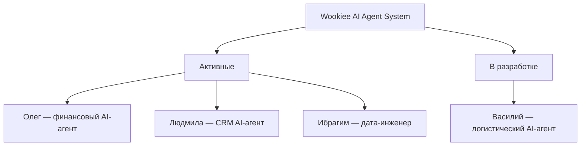

# Wookiee — AI Agent System

Система AI-агентов для управления бизнесом бренда **Wookiee**. Агенты работают с данными из PostgreSQL, Supabase, МойСклад, Wildberries, OZON, Google Sheets, Bitrix24, Telegram — и принимают решения на основе данных.

---

## Визия

**Проблема:** Данные бренда разбросаны по маркетплейсам (Wildberries, OZON), CRM (Bitrix24), Google Sheets, МойСклад, Notion. Каждый источник требует ручной работы для извлечения инсайтов и принятия решений.

**Решение:** Экосистема AI-агентов, где каждый агент автономно решает конкретную бизнес-задачу: финансовая аналитика, управление CRM, оптимизация логистики, инженерия данных. Боты (Telegram, WhatsApp) — это только интерфейсы взаимодействия с агентами.

**Будущее:** Полная структура AI-агентов для data-driven управления бизнесом. Каждый бизнес-процесс покрыт агентом, который анализирует, рекомендует и действует.

---

## Архитектура

```mermaid
graph LR
    subgraph sources["Источники данных"]
        WB[Wildberries API]
        OZ[OZON API]
        B24[Bitrix24]
        GS[Google Sheets]
        MS[МойСклад]
        TGC[Telegram чаты]
    end

    subgraph infra["Инфраструктура"]
        PG[(PostgreSQL)]
        SB[(Supabase)]
        SH[shared/ — data_layer, clients, config]
    end

    subgraph agents["AI-агенты"]
        OLEG["Олег — финансовый аналитик"]
        LYU["Людмила — CRM-ассистент"]
        VAS["Василий — логистика"]
        IBR["Ибрагим — дата-инженер"]
    end

    subgraph interfaces["Интерфейсы"]
        TG[Telegram боты]
        NOT[Notion]
        MD[Markdown Reports]
        GSH[Google Sheets]
    end

    sources --> infra
    infra --> SH
    SH --> agents
    agents --> interfaces
```



### AI-агенты



Подробное описание каждого агента: [`docs/agents/`](docs/agents/)

---

## Компоненты проекта

### AI-агенты

| Агент | Папка | Статус | Назначение |
|-------|-------|--------|------------|
| **Олег** | [`agents/oleg/`](agents/oleg/) | Активен | Финансовый AI-агент: ReAct-аналитик, отчёты, NL-запросы, мониторинг. Интерфейс: Telegram |
| **Людмила** | [`agents/lyudmila/`](agents/lyudmila/) | Активен | CRM AI-агент: задачи, встречи, дайджесты через Bitrix24. Интерфейс: Telegram |
| **Ибрагим** | [`agents/ibrahim/`](agents/ibrahim/) | Активен | Дата-инженер: ETL маркетплейсов, reconciliation, управление схемой БД |
| **Василий** | [`agents/vasily/`](agents/vasily/) | В разработке | Логистический AI-агент: индекс локализации, перемещения между складами WB/OZON |

### Инфраструктура и сервисы

| Папка | Назначение | Статус |
|-------|-----------|--------|
| [`shared/`](shared/) | Общая библиотека: config, data_layer, API-клиенты | Активен |
| [`services/marketplace_etl/`](services/marketplace_etl/) | ETL-пайплайн WB/OZON API → PostgreSQL | Активен |
| [`services/sheets_sync/`](services/sheets_sync/) | Синхронизация Google Sheets ↔ МП | Активен |
| [`services/ozon_delivery/`](services/ozon_delivery/) | Оптимизация доставки OZON | Активен |
| [`sku_database/`](sku_database/) | Товарная матрица (Supabase): 22 модели, 478 артикулов, 1450 SKU | Активен |
| [`scripts/`](scripts/) | CLI-скрипты аналитики (ABC, Notion sync) | Активен |
| [`deploy/`](deploy/) | Docker конфигурация | Инфраструктура |
| [`docs/`](docs/) | Документация: архитектура, ADR, руководства, БД | Справочник |

---

## Структура проекта

```
Wookiee/
├── AGENTS.md                    — правила для AI-агентов
├── CLAUDE.md                    — Claude Code настройки
├── README.md                    — этот файл
├── .env.example                 — шаблон переменных окружения
│
├── shared/                      — общая библиотека
│   ├── config.py               — конфигурация (единый источник)
│   ├── data_layer.py           — слой данных (ВСЕ DB-запросы)
│   ├── db_config.py            — совместимость
│   ├── clients/                — API-клиенты (WB, OZON, МойСклад, Sheets, Bitrix, z.ai)
│   └── utils/                  — утилиты
│
├── agents/                      — AI-агенты
│   ├── oleg/                   — Олег: финансовый AI-агент (ReAct)
│   ├── lyudmila/               — Людмила: CRM AI-агент (Bitrix24)
│   ├── vasily/                 — Василий: логистический AI-агент (WB/OZON)
│   └── ibrahim/                — Ибрагим: дата-инженер (ETL, reconciliation)
│
├── scripts/                     — CLI-скрипты аналитики
│   ├── abc_analysis.py         — ABC-анализ
│   ├── notion_sync.py          — синхронизация с Notion
│   └── ...
│
├── services/                    — доменные сервисы
│   ├── marketplace_etl/        — ETL-пайплайн WB/OZON → PostgreSQL
│   ├── sheets_sync/            — синхронизация Google Sheets ↔ МП
│   └── ozon_delivery/          — оптимизация доставки OZON
│
├── sku_database/                — товарная матрица (Supabase)
│
├── docs/                        — вся документация
│   ├── index.md                — карта навигации
│   ├── agents/                 — описания агентов
│   ├── database/               — справочник БД
│   ├── guides/                 — руководства (DoD, env, logging)
│   └── templates/              — шаблоны документов
│
├── deploy/                      — Docker конфигурация
│   ├── Dockerfile
│   └── docker-compose.yml
│
└── reports/                     — сгенерированные отчёты (git-ignored)
```

---

## Быстрый старт

### Prerequisites

- Python 3.11+
- PostgreSQL (доступ на чтение к базам WB/OZON — предоставляется подрядчиком)
- Docker (опционально, для бота)

### 1. Настроить переменные окружения

```bash
cp .env.example .env
# Заполнить реальные значения в .env
```

### 2. Зависимости для скриптов

```bash
pip install psycopg2-binary python-dotenv
```

### 3. Запустить аналитику

```bash
# Ежедневный отчёт
python scripts/daily_analytics.py --date 2026-02-08 --save --notion

# Отчёт за период
python scripts/period_analytics.py --start 2026-02-01 --end 2026-02-07

# Месячный отчёт
python scripts/monthly_analytics.py --month 2026-01 --save --notion
```

### 4. Запустить Telegram-бот

```bash
cd agents/oleg
pip install -r requirements.txt
cp .env.example .env
nano .env  # заполнить токены

# Запуск
python -m agents.oleg

# Или через Docker (рекомендуется)
docker compose -f deploy/docker-compose.yml up -d
```

Подробнее: [`docs/agents/telegram-bot.md`](docs/agents/telegram-bot.md)

---

## Олег — финансовый AI-агент

AI-агент финансового аналитика с доступом ко всем данным бренда. Telegram-бот — это интерфейс, Олег — автономный ReAct-агент с LLM, набором инструментов и playbook'ом.

**Возможности:**
- Шаблонные отчёты (daily, period, ABC) с интерактивным выбором периодов
- Кастомные запросы на естественном языке через AI
- Автоматическая ежедневная рассылка после 10:05 МСК
- Уведомления о готовности данных (проверка каждые 5 мин, 06:00-12:00 МСК)
- История отчётов с full-text search
- Синхронизация с Notion

**AI-маршрутизация:**
- z.ai (95% запросов, ~$0.002/запрос) — быстрые и простые вопросы
- Claude (5% запросов, ~$0.02/запрос) — сложные аналитические запросы

**Использование:**
1. Найти бота в Telegram
2. `/start` → ввести пароль
3. `/menu` → выбрать тип отчёта или задать вопрос

Полное описание: [`docs/agents/telegram-bot.md`](docs/agents/telegram-bot.md)

---

## Аналитический движок

Ядро системы — скрипты генерации отчётов с верифицированными формулами маржи (<1% расхождение с PowerBI).

### Типы отчётов

| Скрипт | Назначение | Пример |
|--------|-----------|--------|
| `daily_analytics.py` | День vs день + 7-дневный тренд | `--date 2026-02-08 --save --notion` |
| `period_analytics.py` | Произвольный период, 4-уровневая иерархия | `--start 2026-02-01 --end 2026-02-07` |
| `monthly_analytics.py` | Месяц с понедельной динамикой | `--month 2026-01 --save --notion` |

### Ключевые механизмы

**Confidence Scoring** — каждая гипотеза оценивается по формуле:
```
confidence = 0.4 × direction_agreement + 0.35 × magnitude + 0.25 × stability
```

| Диапазон | Интерпретация |
|----------|---------------|
| 0.8-1.0 | Сильный вывод |
| 0.6-0.8 | Вывод с оговоркой |
| 0.3-0.6 | Требует ручной проверки |
| 0.0-0.3 | Спекулятивно |

**Red Team** — алгоритмические контраргументы к каждой гипотезе (день недели, неполные данные, низкая база, изменение СПП, лаг выкупов).

**5-рычажная декомпозиция маржи:** Цена до СПП → СПП% → ДРР → Логистика → Выкуп

**4-уровневая иерархия:** Бренд → Канал (WB/OZON) → Модель → Статус товара

### Архитектурные правила

- **Все DB-запросы** — только в `scripts/data_layer.py`
- **Конфигурация** — только в `scripts/config.py` (читает `.env`)
- **Notion-синхронизация** — через `scripts/notion_sync.py`

Полное описание: [`docs/agents/analytics-engine.md`](docs/agents/analytics-engine.md)

---

## Notion-интеграция

Отчёты автоматически синхронизируются с базой **"Фин аналитика"** в Notion.

```bash
# Автоматически при генерации отчёта
python scripts/daily_analytics.py --date 2026-02-08 --save --notion

# Ручная синхронизация
python scripts/notion_sync.py --file reports/2026-02-01_2026-02-07_analytics.md
```

- Если страница с таким периодом существует — контент перезаписывается
- Если нет — создаётся новая страница
- Отчёты из бота помечаются "Telegram Bot", из скриптов — "Скрипт"

---

## Источники данных

| Источник | БД / API | Что хранит | Обновление |
|----------|----------|------------|------------|
| Wildberries | `pbi_wb_wookiee` (PostgreSQL) | Финансы, трафик, заказы, реклама (853K+ строк) | Ежедневно ~06:18 МСК |
| OZON | `pbi_ozon_wookiee` (PostgreSQL) | Финансы, трафик, заказы, реклама (156K+ строк) | Ежедневно ~07:03 МСК |
| Товарная матрица | Supabase | Модели, артикулы, SKU, статусы, цвета | По запросу |
| МойСклад | API | Остатки, себестоимость, номенклатура | По запросу |
| Bitrix24 | API | Задачи, встречи, контакты, CRM | Реальное время |
| Google Sheets | API | Оперативные данные, контроль цен/остатков | Синхронизация |
| Notion | API | Хранение отчётов | При генерации |

Базы WB/OZON предоставляются подрядчиком (доступ только на чтение). Данные обновляются автоматически.

Полный справочник схем, формул и маппинга: [`docs/database/DATABASE_REFERENCE.md`](docs/database/DATABASE_REFERENCE.md)

Известные проблемы качества данных: [`docs/database/DATA_QUALITY_NOTES.md`](docs/database/DATA_QUALITY_NOTES.md)

---

## Бизнес-правила

Аналитика опирается на правила Wookiee как на **гибкие ориентиры**, а не жёсткие ограничения:

- Декомпозиция маржи по 5 рычагам: Цена до СПП → СПП% → ДРР → Логистика → Выкуп
- Целевая рентабельность: от 15% по чистой прибыли
- ABC-классификация: A (~70% маржи), B (~20%), C (~10%)
- Рекомендации описывают цепочки причин и следствий с расчётом эффекта в рублях

---

## Технологический стек

| Категория | Технологии |
|-----------|-----------|
| Язык | Python 3.11+ |
| Базы данных | PostgreSQL (финансы WB/OZON), Supabase (товарная матрица), SQLite FTS5 (история отчётов) |
| Интерфейсы | aiogram 3.15, APScheduler 3.10.4 |
| AI / LLM | z.ai API (GLM-4-plus, GLM-4.5-flash), Claude API (Opus 4.6, Sonnet 4.5) via OpenRouter |
| Интеграции | Notion API, Bitrix24 API, Wildberries API, OZON API, МойСклад API, Google Sheets API |
| Инфраструктура | Docker, docker-compose |
| Безопасность | bcrypt (пароли), .env (секреты), .cursorignore (защита от AI) |

---

## Roadmap

### Активные AI-агенты
- **Олег** — финансовый AI-агент: отчёты, NL-запросы, мониторинг данных, ценовая аналитика
- **Людмила** — CRM AI-агент: задачи, встречи, дайджесты через Bitrix24
- **Ибрагим** — дата-инженер: ETL маркетплейсов, reconciliation, управление схемой БД

### В разработке
- **Василий** — логистический AI-агент: автоматизация перемещений между складами (WB/OZON)
- Расширение AI-возможностей агентов (прогнозирование, inter-agent коммуникация)

### Планируемые
- AB-тестирование и ценовые эксперименты
- Мульти-агентная координация (агенты обмениваются контекстом)

---

## Для AI-агентов разработки (Claude Code, Cursor)

Все правила проекта: [`AGENTS.md`](AGENTS.md) (единственный источник истины).

Навигация по документации: [`docs/index.md`](docs/index.md).

**Обязательные правила:**
- DB-запросы: только `shared/data_layer.py`
- GROUP BY по модели: ВСЕГДА с `LOWER()`
- Процентные метрики: ТОЛЬКО средневзвешенные
- Проблемы качества данных: фиксировать в `docs/database/DATA_QUALITY_NOTES.md`

---

## Для разработчиков

- **Git-конвенции:** коммиты на английском, ветки `feature/`, `fix/`, `docs/`, `refactor/`
- **DoD чеклист:** [`docs/guides/dod.md`](docs/guides/dod.md)
- **Настройка окружения:** [`docs/guides/environment-setup.md`](docs/guides/environment-setup.md)
- **Архитектурные решения:** [`docs/adr.md`](docs/adr.md)
- **Логирование:** [`docs/guides/logging.md`](docs/guides/logging.md)
