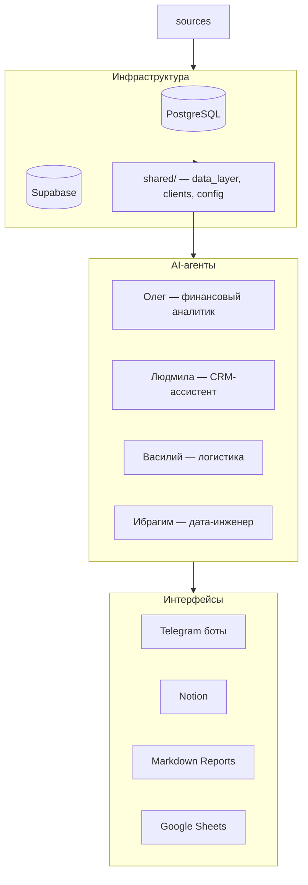
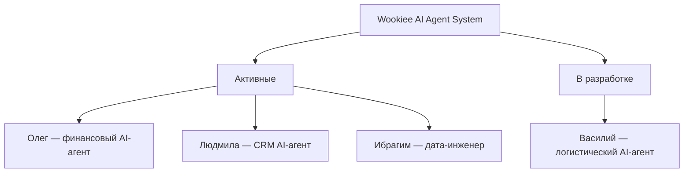

# Wookiee

Система AI-модулей для управления бизнесом бренда Wookiee.

Текущий production-контур:
- `agents/oleg`
- `agents/ibrahim`
- `services/marketplace_etl`
- `services/sheets_sync`
- `services/wb_localization`
- `deploy`

## Active Components

### Agents

- `agents/oleg/` — финансовый AI-агент (Telegram runtime + price analytics)
- `agents/ibrahim/` — data-engineering модуль (ETL/reconciliation/DB)

### Services

- `services/marketplace_etl/` — WB/OZON API -> PostgreSQL
- `services/sheets_sync/` — синхронизация Google Sheets
- `services/wb_localization/` — расчёт локализации WB + экспорт в Sheets
- `services/vasily_api/` — HTTP trigger для запуска WB localization
- `services/ozon_delivery/` — утилиты по доставке OZON

### Shared

- `shared/config.py` — единая конфигурация
- `shared/data_layer.py` — единый слой SQL/данных
- `shared/clients/*` — API-клиенты

### Архитектура



### AI-агенты



Подробное описание каждого агента: [`docs/agents/`](docs/agents/)

---

## Компоненты проекта

### AI-агенты

| Агент | Папка | Статус | Назначение |
|-------|-------|--------|------------|
| **Олег** | [`agents/oleg/`](agents/oleg/) | Активен | Финансовый AI-агент: ReAct-аналитик, отчёты, NL-запросы, мониторинг. Интерфейс: Telegram |
| **Людмила** | [`agents/lyudmila/`](agents/lyudmila/) | Активен | CRM AI-агент: задачи, встречи, дайджесты через Bitrix24. Интерфейс: Telegram |
| **Ибрагим** | [`agents/ibrahim/`](agents/ibrahim/) | Активен | Дата-инженер: ETL маркетплейсов, reconciliation, управление схемой БД |
| **Василий** | [`agents/vasily/`](agents/vasily/) | В разработке | Логистический AI-агент: индекс локализации, перемещения между складами WB/OZON |

### Инфраструктура и сервисы

| Папка | Назначение | Статус |
|-------|-----------|--------|
| [`shared/`](shared/) | Общая библиотека: config, data_layer, API-клиенты | Активен |
| [`services/marketplace_etl/`](services/marketplace_etl/) | ETL-пайплайн WB/OZON API → PostgreSQL | Активен |
| [`services/sheets_sync/`](services/sheets_sync/) | Синхронизация Google Sheets ↔ МП | Активен |
| [`services/ozon_delivery/`](services/ozon_delivery/) | Оптимизация доставки OZON | Активен |
| [`sku_database/`](sku_database/) | Товарная матрица (Supabase pooler). Заполняйте `POSTGRES_*` (fallback `SUPABASE_*`). | Активен |
| [`scripts/`](scripts/) | CLI-скрипты аналитики (ABC, Notion sync) | Активен |
| [`deploy/`](deploy/) | Docker конфигурация | Инфраструктура |
| [`docs/`](docs/) | Документация: архитектура, ADR, руководства, БД | Справочник |

---

## Структура проекта

```
Wookiee/
├── AGENTS.md                    — правила для AI-агентов
├── CLAUDE.md                    — Claude Code настройки
├── README.md                    — этот файл
├── .env.example                 — шаблон переменных окружения
│
├── shared/                      — общая библиотека
│   ├── config.py               — конфигурация (единый источник)
│   ├── data_layer.py           — слой данных (ВСЕ DB-запросы)
│   ├── db_config.py            — совместимость
│   ├── clients/                — API-клиенты (WB, OZON, МойСклад, Sheets, Bitrix, z.ai)
│   └── utils/                  — утилиты
│
├── agents/                      — AI-агенты
│   ├── oleg/                   — Олег: финансовый AI-агент (ReAct)
│   ├── lyudmila/               — Людмила: CRM AI-агент (Bitrix24)
│   ├── vasily/                 — Василий: логистический AI-агент (WB/OZON)
│   └── ibrahim/                — Ибрагим: дата-инженер (ETL, reconciliation)
│
├── scripts/                     — CLI-скрипты аналитики
│   ├── abc_analysis.py         — ABC-анализ
│   ├── notion_sync.py          — синхронизация с Notion
│   └── ...
│
├── services/                    — доменные сервисы
│   ├── marketplace_etl/        — ETL-пайплайн WB/OZON → PostgreSQL
│   ├── sheets_sync/            — синхронизация Google Sheets ↔ МП
│   └── ozon_delivery/          — оптимизация доставки OZON
│
├── sku_database/                — товарная матрица (Supabase)
│
├── docs/                        — вся документация
│   ├── index.md                — карта навигации
│   ├── agents/                 — описания агентов
│   ├── database/               — справочник БД
│   ├── guides/                 — руководства (DoD, env, logging)
│   └── templates/              — шаблоны документов
│
├── deploy/                      — Docker конфигурация
│   ├── Dockerfile
│   └── docker-compose.yml
│
└── reports/                     — сгенерированные отчёты (git-ignored)
```

---

## Entrypoints

```bash
# Oleg bot (default)
python -m agents.oleg

# Oleg agent loop
python -m agents.oleg agent

# Sheets sync
python -m services.sheets_sync

# Marketplace ETL daily sync
python -m services.marketplace_etl.scripts.run_daily_sync

# WB localization dry-run
python -m services.wb_localization.run_localization --dry-run

# Vasily API
uvicorn services.vasily_api.app:app --host 0.0.0.0 --port 8000
```

## CLI Scripts (`scripts/`)

Актуальные публичные скрипты:
- `scripts/abc_analysis.py`
- `scripts/abc_analysis_unified.py`
- `scripts/notion_sync.py`
- `scripts/wb_vuki_ratings.py`

Совместимость-шимы:
- `scripts/config.py`
- `scripts/data_layer.py`

## Quick Setup

```bash
cp .env.example .env
pip install -r agents/oleg/requirements.txt
pip install -r services/sheets_sync/requirements.txt
pip install -r services/vasily_api/requirements.txt
```

## Quality Gates

Локальная проверка:

```bash
python -m compileall -q agents services shared scripts
python -m pytest -q
python -m pytest -q services/marketplace_etl/tests
```

CI:
- `.github/workflows/ci.yml` — compileall + тесты (Python 3.11)
- `.github/workflows/deploy.yml` — deploy после успешного CI на `main`

## Docs

- `docs/index.md` — карта документации
- `docs/architecture.md` — текущая архитектура
- `docs/adr.md` — архитектурные решения
- `docs/development-history.md` — история изменений

---

## Бизнес-правила

Аналитика опирается на правила Wookiee как на **гибкие ориентиры**, а не жёсткие ограничения:

- Декомпозиция маржи по 5 рычагам: Цена до СПП → СПП% → ДРР → Логистика → Выкуп
- Целевая рентабельность: от 15% по чистой прибыли
- ABC-классификация: A (~70% маржи), B (~20%), C (~10%)
- Рекомендации описывают цепочки причин и следствий с расчётом эффекта в рублях

---

## Технологический стек

| Категория | Технологии |
|-----------|-----------|
| Язык | Python 3.11+ |
| Базы данных | PostgreSQL (финансы WB/OZON), Supabase pooler (товарная матрица, keys `POSTGRES_*`, fallback `SUPABASE_*`), SQLite FTS5 (история отчётов) |
| Интерфейсы | aiogram 3.15, APScheduler 3.10.4 |
| AI / LLM | z.ai API (GLM-4-plus, GLM-4.5-flash), Claude API (Opus 4.6, Sonnet 4.5) via OpenRouter |
| Интеграции | Notion API, Bitrix24 API, Wildberries API, OZON API, МойСклад API, Google Sheets API |
| Инфраструктура | Docker, docker-compose |
| Безопасность | bcrypt (пароли), .env (секреты), .cursorignore (защита от AI) |

---

## Roadmap

### Активные AI-агенты
- **Олег** — финансовый AI-агент: отчёты, NL-запросы, мониторинг данных, ценовая аналитика
- **Людмила** — CRM AI-агент: задачи, встречи, дайджесты через Bitrix24
- **Ибрагим** — дата-инженер: ETL маркетплейсов, reconciliation, управление схемой БД

### В разработке
- **Василий** — логистический AI-агент: автоматизация перемещений между складами (WB/OZON)
- Расширение AI-возможностей агентов (прогнозирование, inter-agent коммуникация)

### Планируемые
- AB-тестирование и ценовые эксперименты
- Мульти-агентная координация (агенты обмениваются контекстом)

---

## Для AI-агентов разработки (Claude Code, Cursor)

Все правила проекта: [`AGENTS.md`](AGENTS.md) (единственный источник истины).

Навигация по документации: [`docs/index.md`](docs/index.md).

**Обязательные правила:**
- DB-запросы: только `shared/data_layer.py`
- GROUP BY по модели: ВСЕГДА с `LOWER()`
- Процентные метрики: ТОЛЬКО средневзвешенные
- Проблемы качества данных: фиксировать в `docs/database/DATA_QUALITY_NOTES.md`

---

## Для разработчиков

- **Git-конвенции:** коммиты на английском, ветки `feature/`, `fix/`, `docs/`, `refactor/`
- **DoD чеклист:** [`docs/guides/dod.md`](docs/guides/dod.md)
- **Настройка окружения:** [`docs/guides/environment-setup.md`](docs/guides/environment-setup.md)
- **Архитектурные решения:** [`docs/adr.md`](docs/adr.md)
- **Логирование:** [`docs/guides/logging.md`](docs/guides/logging.md)

---

## Archive / Retired

- `docs/archive/retired_agents/lyudmila/`
- `docs/archive/retired_agents/vasily_agent_runtime/`
- `docs/archive/agents/lyudmila-bot.md`
