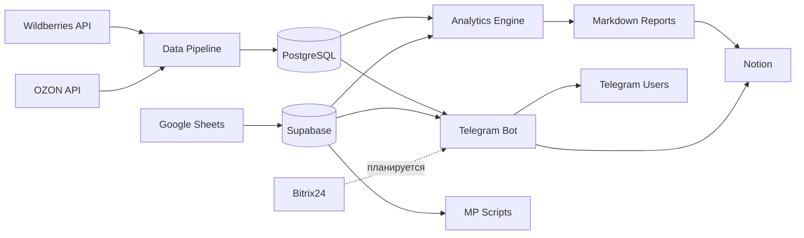
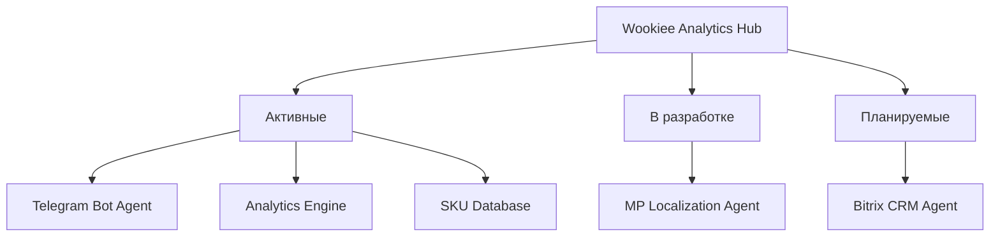

# Wookiee Analytics — Data Hub

Централизованный хаб по работе с данными бренда нижнего белья **Wookiee**. Объединяет финансовую аналитику маркетплейсов, товарную матрицу, оптимизацию логистики и CRM — в единую экосистему с AI-агентами.

---

## Визия

**Проблема:** Данные бренда разбросаны по маркетплейсам (Wildberries, OZON), CRM (Bitrix24), Google Sheets, Notion. Каждый источник требует ручной работы для извлечения инсайтов.

**Решение:** Wookiee Analytics — единая точка доступа ко всем данным компании. Каждый модуль проекта — это автономный **агент**, который решает конкретную бизнес-задачу: от ежедневных финансовых отчётов до оптимизации распределения товаров по складам.

**Будущее:** Полная автоматизация рутинных аналитических задач через AI-агентов. Один Telegram-бот как интерфейс ко всем данным и процессам компании.

---

## Архитектура

### Поток данных



### Агенты проекта



Подробное описание каждого агента: [`agents/`](agents/)

---

## Компоненты проекта

| Папка | Назначение | Статус | Описание |
|-------|-----------|--------|----------|
| [`bot/`](bot/) | Telegram-бот с AI-агентом | Активен | Финансовый ассистент: отчёты, NL-запросы, мониторинг |
| [`scripts/`](scripts/) | Аналитический движок | Активен | Daily/period/monthly отчёты, Notion-синхронизация |
| [`wookiee_sku_database/`](wookiee_sku_database/) | Товарная матрица (Supabase) | Активен | 22 модели, 478 артикулов, 1450 SKU |
| [`MP scripts/`](MP%20scripts/) | Оптимизация логистики MP | В разработке | Индекс локализации WB, время доставки OZON |
| [`Bitrix/`](Bitrix/) | Интеграция с Bitrix24 | Планируется | OAuth-клиент готов, бизнес-логика не реализована |
| [`database_docs/`](database_docs/) | Документация по БД | Справочник | Схемы, формулы, качество данных |
| [`agent_docs/`](agent_docs/) | Документация для AI-разработки | Справочник | Архитектура, ADR, руководства, шаблоны |
| [`reports/`](reports/) | Сгенерированные отчёты | git-ignored | Markdown-файлы аналитики |
| [`agents/`](agents/) | Описания агентов проекта | Документация | Бизнес + техническое описание каждого модуля |

---

## Структура проекта

```
Wookiee/
├── AGENTS.md                    — универсальные правила для AI-агентов
├── CLAUDE.md                    — Claude Code настройки
├── README.md                    — этот файл
├── .env.example                 — шаблон переменных окружения
├── .gitignore                   — правила git ignore
├── .cursorignore                — защита секретов от AI
│
├── agents/                      — описания агентов проекта
│   ├── README.md                — обзор агентной архитектуры
│   ├── telegram-bot.md          — Telegram Bot Agent
│   ├── analytics-engine.md      — Analytics Engine Agent
│   ├── mp-localization.md       — MP Localization Agent
│   └── bitrix-crm.md           — Bitrix CRM Agent
│
├── bot/                         — Telegram-бот
│   ├── main.py                  — точка входа
│   ├── config.py                — конфигурация
│   ├── handlers/                — обработчики (auth, menu, reports, queries)
│   ├── services/                — бизнес-логика (AI, отчёты, хранилище)
│   └── data/                    — SQLite база с историей отчётов
│
├── scripts/                     — аналитический движок
│   ├── config.py                — настройки (читает из .env)
│   ├── data_layer.py            — общий слой данных (ВСЕ DB-запросы)
│   ├── daily_analytics.py       — ежедневная аналитика + confidence scores
│   ├── period_analytics.py      — аналитика за произвольный период
│   ├── monthly_analytics.py     — месячный отчёт с понедельной динамикой
│   └── notion_sync.py           — синхронизация с Notion
│
├── wookiee_sku_database/        — товарная матрица (Supabase)
│   ├── db.py                    — CLI-инструмент
│   ├── database/                — схема, модели, триггеры
│   ├── config/                  — подключение и маппинг полей
│   └── scripts/                 — миграции и импорт
│
├── MP scripts/                  — оптимизация логистики маркетплейсов
│   ├── Index_localization WB/   — индекс локализации WB
│   └── Index_localization Ozon/ — время доставки OZON
│
├── Bitrix/                      — интеграция с Bitrix24
│   ├── client.py                — OAuth 2.0 клиент
│   └── config.py                — конфигурация
│
├── database_docs/               — документация по схемам БД
│   ├── DATABASE_REFERENCE.md    — полный справочник (41 таблица WB, 24 OZON)
│   ├── DATA_QUALITY_NOTES.md    — известные проблемы данных
│   └── DATABASE_WORKPLAN.md     — открытые вопросы
│
├── agent_docs/                  — документация для AI-разработки
│   ├── index.md                 — карта навигации
│   ├── architecture.md          — архитектура системы
│   ├── adr.md                   — архитектурные решения
│   ├── development-history.md   — журнал итераций
│   ├── guides/                  — руководства (DoD, env, logging)
│   └── templates/               — шаблоны документов
│
├── reports/                     — сгенерированные отчёты (git-ignored)
│
├── Dockerfile                   — контейнер бота
├── docker-compose.yml           — Docker orchestration
└── setup_bot.sh                 — скрипт установки
```

---

## Быстрый старт

### Prerequisites

- Python 3.11+
- PostgreSQL (доступ на чтение к базам WB/OZON — предоставляется подрядчиком)
- Docker (опционально, для бота)

### 1. Настроить переменные окружения

```bash
cp .env.example .env
# Заполнить реальные значения в .env
```

### 2. Зависимости для скриптов

```bash
pip install psycopg2-binary python-dotenv
```

### 3. Запустить аналитику

```bash
# Ежедневный отчёт
python scripts/daily_analytics.py --date 2026-02-08 --save --notion

# Отчёт за период
python scripts/period_analytics.py --start 2026-02-01 --end 2026-02-07

# Месячный отчёт
python scripts/monthly_analytics.py --month 2026-01 --save --notion
```

### 4. Запустить Telegram-бот

```bash
cd bot
pip install -r requirements.txt
cp .env.example .env
nano .env  # заполнить токены

# Запуск
python -m bot.main

# Или через Docker (рекомендуется)
docker-compose up -d
```

Подробнее: [`agents/telegram-bot.md`](agents/telegram-bot.md)

---

## Telegram-бот

AI-ассистент финансового менеджера с доступом ко всем данным бренда.

**Возможности:**
- Шаблонные отчёты (daily, period, ABC) с интерактивным выбором периодов
- Кастомные запросы на естественном языке через AI
- Автоматическая ежедневная рассылка после 10:05 МСК
- Уведомления о готовности данных (проверка каждые 5 мин, 06:00-12:00 МСК)
- История отчётов с full-text search
- Синхронизация с Notion

**AI-маршрутизация:**
- z.ai (95% запросов, ~$0.002/запрос) — быстрые и простые вопросы
- Claude (5% запросов, ~$0.02/запрос) — сложные аналитические запросы

**Использование:**
1. Найти бота в Telegram
2. `/start` → ввести пароль
3. `/menu` → выбрать тип отчёта или задать вопрос

Полное описание: [`agents/telegram-bot.md`](agents/telegram-bot.md)

---

## Аналитический движок

Ядро системы — скрипты генерации отчётов с верифицированными формулами маржи (<1% расхождение с PowerBI).

### Типы отчётов

| Скрипт | Назначение | Пример |
|--------|-----------|--------|
| `daily_analytics.py` | День vs день + 7-дневный тренд | `--date 2026-02-08 --save --notion` |
| `period_analytics.py` | Произвольный период, 4-уровневая иерархия | `--start 2026-02-01 --end 2026-02-07` |
| `monthly_analytics.py` | Месяц с понедельной динамикой | `--month 2026-01 --save --notion` |

### Ключевые механизмы

**Confidence Scoring** — каждая гипотеза оценивается по формуле:
```
confidence = 0.4 × direction_agreement + 0.35 × magnitude + 0.25 × stability
```

| Диапазон | Интерпретация |
|----------|---------------|
| 0.8-1.0 | Сильный вывод |
| 0.6-0.8 | Вывод с оговоркой |
| 0.3-0.6 | Требует ручной проверки |
| 0.0-0.3 | Спекулятивно |

**Red Team** — алгоритмические контраргументы к каждой гипотезе (день недели, неполные данные, низкая база, изменение СПП, лаг выкупов).

**5-рычажная декомпозиция маржи:** Цена до СПП → СПП% → ДРР → Логистика → Выкуп

**4-уровневая иерархия:** Бренд → Канал (WB/OZON) → Модель → Статус товара

### Архитектурные правила

- **Все DB-запросы** — только в `scripts/data_layer.py`
- **Конфигурация** — только в `scripts/config.py` (читает `.env`)
- **Notion-синхронизация** — через `scripts/notion_sync.py`

Полное описание: [`agents/analytics-engine.md`](agents/analytics-engine.md)

---

## Notion-интеграция

Отчёты автоматически синхронизируются с базой **"Фин аналитика"** в Notion.

```bash
# Автоматически при генерации отчёта
python scripts/daily_analytics.py --date 2026-02-08 --save --notion

# Ручная синхронизация
python scripts/notion_sync.py --file reports/2026-02-01_2026-02-07_analytics.md
```

- Если страница с таким периодом существует — контент перезаписывается
- Если нет — создаётся новая страница
- Отчёты из бота помечаются "Telegram Bot", из скриптов — "Скрипт"

---

## Источники данных

| Источник | БД | Что хранит | Обновление |
|----------|-------|------------|------------|
| Wildberries | `pbi_wb_wookiee` (PostgreSQL) | Финансы, трафик, заказы, реклама (853K+ строк) | Ежедневно ~06:18 МСК |
| OZON | `pbi_ozon_wookiee` (PostgreSQL) | Финансы, трафик, заказы, реклама (156K+ строк) | Ежедневно ~07:03 МСК |
| Товарная матрица | Supabase | Модели, артикулы, SKU, статусы, цвета | По запросу |
| Notion | API | Хранение отчётов | При генерации |

Базы WB/OZON предоставляются подрядчиком (доступ только на чтение). Данные обновляются автоматически.

Полный справочник схем, формул и маппинга: [`database_docs/DATABASE_REFERENCE.md`](database_docs/DATABASE_REFERENCE.md)

Известные проблемы качества данных: [`database_docs/DATA_QUALITY_NOTES.md`](database_docs/DATA_QUALITY_NOTES.md)

---

## Бизнес-правила

Аналитика опирается на правила Wookiee как на **гибкие ориентиры**, а не жёсткие ограничения:

- Декомпозиция маржи по 5 рычагам: Цена до СПП → СПП% → ДРР → Логистика → Выкуп
- Целевая рентабельность: от 15% по чистой прибыли
- ABC-классификация: A (~70% маржи), B (~20%), C (~10%)
- Рекомендации описывают цепочки причин и следствий с расчётом эффекта в рублях

---

## Технологический стек

| Категория | Технологии |
|-----------|-----------|
| Язык | Python 3.11+ |
| Базы данных | PostgreSQL (финансы WB/OZON), Supabase (товарная матрица), SQLite FTS5 (история отчётов) |
| Бот | aiogram 3.15, APScheduler 3.10.4 |
| AI | z.ai API (GLM-4.5-flash), Claude API (Sonnet 4.5) |
| Интеграции | Notion API, Bitrix24 API (планируется) |
| Инфраструктура | Docker, docker-compose |
| Безопасность | bcrypt (пароли), .env (секреты), .cursorignore (защита от AI) |

---

## Roadmap

### Активные компоненты
- Telegram Bot Agent — ежедневные отчёты, AI-запросы, мониторинг данных
- Analytics Engine — daily/period/monthly аналитика с confidence scoring
- SKU Database — товарная матрица на Supabase (22 модели, 1450 SKU)

### В разработке
- MP Localization Agent — автоматизация перемещений между складами (WB/OZON)
- Расширение AI-возможностей бота (более глубокий анализ, прогнозирование)

### Планируемые
- Bitrix CRM Agent — постановка задач, анализ процессов, работа с базой знаний
- AB-тестирование и ценовые эксперименты
- Единый дашборд с real-time данными

---

## Для AI-агентов

Все правила проекта: [`AGENTS.md`](AGENTS.md) (единственный источник истины).

Навигация по документации: [`agent_docs/index.md`](agent_docs/index.md).

**Обязательные правила:**
- DB-запросы: только `scripts/data_layer.py`
- GROUP BY по модели: ВСЕГДА с `LOWER()`
- Процентные метрики: ТОЛЬКО средневзвешенные
- Проблемы качества данных: фиксировать в `database_docs/DATA_QUALITY_NOTES.md`

---

## Для разработчиков

- **Git-конвенции:** коммиты на английском, ветки `feature/`, `fix/`, `docs/`, `refactor/`
- **DoD чеклист:** [`agent_docs/guides/dod.md`](agent_docs/guides/dod.md)
- **Настройка окружения:** [`agent_docs/guides/environment-setup.md`](agent_docs/guides/environment-setup.md)
- **Архитектурные решения:** [`agent_docs/adr.md`](agent_docs/adr.md)
- **Логирование:** [`agent_docs/guides/logging.md`](agent_docs/guides/logging.md)
