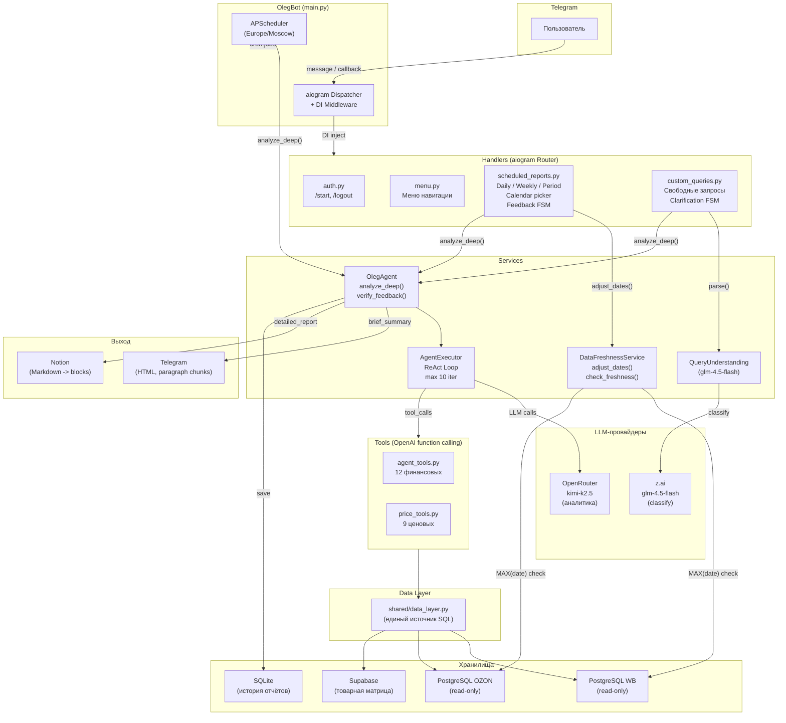

# Oleg Bot -- Системная документация

> **Последнее обновление:** 2026-02-16

Oleg -- ИИ финансовый и бизнес-аналитик бренда Wookiee. Telegram-бот на aiogram 3.x с ReAct-агентом: LLM сам решает какие данные запросить, итеративно углубляется в проблему, проверяет расчёты и генерирует готовый отчёт.

Бренд Wookiee продаёт одежду на маркетплейсах WB и OZON. Бот анализирует финансовые данные обоих каналов, строит причинно-следственные цепочки и даёт конкретные рекомендации.

---

## 1. Архитектура

### Блок-схема (Mermaid)



### Текстовая схема (для терминала)

```
Telegram --> aiogram 3.x (Dispatcher + DI Middleware)
                |
                v
         Handlers (auth, menu, scheduled_reports, custom_queries)
                |
                +-- DataFreshnessService.adjust_dates() -- корректировка периода
                |
                v
         OlegAgent.analyze_deep()  (все пути: ручные + авто)
                |
                v
         AgentExecutor (ReAct loop: Think -> Act -> Observe, max 10 iter)
                |
                v
         agent_tools.py (12) + price_tools.py (9) = 21 инструмент
                |
                v
         shared/data_layer.py (SQL-запросы к PostgreSQL)
                |
                v
         PostgreSQL WB / PostgreSQL OZON / Supabase (товарная матрица)
```

### LLM-провайдеры

| Задача | Провайдер | Модель | Стоимость |
|--------|-----------|--------|-----------|
| Аналитика (tool-use) | OpenRouter | `moonshotai/kimi-k2.5` | $0.00045 / $0.00044 за 1K |
| Classify / clarify | z.ai | `glm-4.5-flash` | $0.0001 / $0.0002 за 1K |
| Fallback аналитики | z.ai | `glm-4-plus` | $0.007 / $0.007 за 1K |

Если `OPENROUTER_API_KEY` не задан, аналитика переключается на z.ai `glm-4-plus`.

### Компоненты системы

#### Точки входа

- **`main.py`** -- класс `OlegBot`: инициализация всех сервисов, DI-middleware, scheduling, recovery, polling с ConflictError-таймаутом
- **`__main__.py`** -- `python -m agents.oleg` вызывает `main()` из `main.py`

#### Ядро агента

- **`services/oleg_agent.py`** -- класс `OlegAgent`:
  - `analyze_deep()` -- глубокий анализ с post-check обязательных tool calls + retry. **Используется ВЕЗДЕ** (ручные + автоматические отчёты)
  - `analyze()` -- стандартный анализ с протоколом 7 шагов (legacy, не используется в текущих путях)
  - `verify_feedback()` -- перепроверка обратной связи через инструменты (не просто соглашается)
  - Формирует system prompt из playbook + feedback lessons + протокол анализа
  - Поддержка `data_availability_note` в user message -- LLM знает про недостающие даты

- **`services/agent_executor.py`** -- класс `AgentExecutor`:
  - ReAct loop: вызов LLM -> проверка tool_calls -> исполнение инструментов -> добавление результатов в контекст -> повтор
  - `run()` -- основной цикл, макс. 10 итераций
  - `continue_run()` -- продолжение анализа из prior_result (для post-check в analyze_deep)
  - Truncation tool results > 8000 chars для предотвращения context overflow
  - Расчёт стоимости на основе `config.PRICING`

- **`services/agent_tools.py`** -- 12 инструментов финансовой аналитики (OpenAI function calling format):
  - `get_brand_finance` -- общая сводка WB + OZON (маржа, выручка, заказы, реклама, ДРР, СПП)
  - `get_channel_finance` -- детальные финансы одного канала (все расходные статьи)
  - `get_model_breakdown` -- топ моделей по марже с изменениями vs prev. period
  - `get_margin_levers` -- декомпозиция маржи по 5 рычагам + waterfall + counterfactual
  - `get_advertising_stats` -- рекламная статистика + воронка (WB)
  - `get_model_advertising` -- реклама WB по моделям
  - `get_orders_by_model` -- заказы по моделям для CPO
  - `get_daily_trend` -- дневная динамика метрик
  - `get_weekly_breakdown` -- понедельная разбивка для месячных отчётов
  - `validate_data_quality` -- проверка retention==deduction, корректировка маржи
  - `get_product_statuses` -- статусы товаров из Supabase
  - `calculate_metric` -- safe calculator для верификации расчётов

- **`services/price_tools.py`** -- 9 инструментов ценовой аналитики:
  - `get_price_elasticity` -- эластичность спроса (с кэшированием в LearningStore)
  - `get_price_margin_correlation` -- Pearson + Spearman с p-value
  - `get_price_recommendation` -- рекомендация с ранжированием сценариев
  - `simulate_price_change` -- прогноз "что если цену изменить на X%"
  - `get_price_counterfactual` -- контрфактуал по историческим данным
  - `analyze_promotion` -- анализ акций WB/OZON
  - `get_price_trend` -- Mann-Kendall test, волатильность, скользящее среднее
  - `get_recommendation_history` -- история рекомендаций и точность прогнозов
  - `get_price_changes_detected` -- обнаружение значимых ценовых изменений (>3%)

#### Обработка данных

- **`shared/data_layer.py`** -- все SQL-запросы к PostgreSQL (WB и OZON). Единственное место для DB-запросов (правило из AGENTS.md)
- **`services/data_freshness_service.py`** -- проверка готовности данных + smart date adjustment (см. раздел 2.9)
- **`services/query_understanding.py`** -- LLM-парсинг запросов пользователя (glm-4.5-flash, ~$0.0001/call)

#### Форматирование и хранение

- **`services/report_formatter.py`** -- BBCode -> HTML для Telegram, inline-клавиатуры
- **`services/notion_service.py`** -- async Notion API: Markdown -> Notion blocks, upsert страниц
- **`services/report_storage.py`** -- SQLite с FTS5 для истории отчётов

#### Инфраструктура

- **`services/auth_service.py`** -- bcrypt аутентификация, JSON persistence
- **`services/scheduler_service.py`** -- APScheduler wrapper (AsyncIOScheduler, Europe/Moscow)
- **`services/feedback_service.py`** -- обработка обратной связи через Notion
- **`services/price_analysis/`** -- regression, recommendation, scenario, learning_store, promotion, roi, stock_price

#### Handlers (aiogram Router)

- **`handlers/auth.py`** -- /start, /logout, ввод пароля
- **`handlers/menu.py`** -- главное меню, подменю отчётов, ценового анализа, помощь
- **`handlers/scheduled_reports.py`** -- шаблонные отчёты (daily, weekly, period), calendar picker, FSM для feedback. Все хендлеры используют `analyze_deep()` + smart date adjustment
- **`handlers/custom_queries.py`** -- свободные запросы с LLM-парсингом, FSM (clarification -> confirmation -> execution)

#### Конфигурация

- **`config.py`** -- все env vars, пути, расписание, pricing
- **`playbook.md`** -- бизнес-правила и протокол анализа для system prompt агента

---

## 2. Workflow отчётов

### Ключевой принцип: Smart Date Adjustment

Все пути генерации отчётов (ручные и автоматические) используют **smart date adjustment** вместо блокировки:

```
Запрос: "отчёт за 09-15 февраля"
                |
                v
    DataFreshnessService.adjust_dates("2026-02-09", "2026-02-15")
                |
                v
    get_latest_data_date() -> MAX(date) из WB и OZON -> min(wb, ozon)
                |
                v
    Последние данные: 2026-02-14
                |
                v
    return ("2026-02-09", "2026-02-14",
            "Данные доступны до 14.02.2026. Нет данных за 1 дн.
             Период скорректирован: 09.02–14.02.2026.")
                |
                v
    params["data_availability_note"] = note
                |
                v
    OlegAgent._build_user_message() -> "⚠️ Данные доступны до 14.02.2026..."
                |
                v
    LLM видит ограничение в user message -> упоминает в отчёте
```

**Исключение:** автоматический дневной отчёт (`send_daily_report()`) использует blocking freshness check, т.к. data freshness monitor позже дотриггерит генерацию.

### 2.1. Автоматический дневной отчёт

**Расписание:** каждый день в `DAILY_REPORT_TIME` (по умолчанию 10:05 MSK).

```
1. SchedulerService -> send_daily_report()
2. data_freshness.check_freshness() -- готовы ли данные?
   - НЕ готовы: уведомление пользователям + return (отчёт отложен)
   - Готовы: продолжаем
3. oleg_agent.analyze_deep() -- ReAct loop:
   - System prompt = playbook + feedback lessons + протокол 7 шагов
   - Минимум 6 tool calls (get_brand_finance, get_channel_finance x2,
     get_model_breakdown x2, get_margin_levers x2, get_advertising_stats,
     validate_data_quality)
   - Post-check: если пропущены обязательные инструменты -> continue_run
   - Результат: {brief_summary (BBCode), detailed_report (Markdown)}
4. Валидация: если detailed_report содержит raw JSON -> fallback на brief
5. notion_service.sync_report() -> URL страницы Notion
6. ReportFormatter.format_for_telegram() -> HTML
7. Отправка всем authenticated_users (или ADMIN_CHAT_ID как fallback)
8. report_storage.save_report() -- сохранение в SQLite
9. _daily_report_sent_date = today
```

### 2.2. Еженедельный отчёт

**Расписание:** понедельник, `WEEKLY_REPORT_TIME` (по умолчанию 10:15 MSK).

```
1. send_weekly_report()
2. data_freshness.adjust_dates(start, end) -- smart date adjustment
   - Если данные за end_date ещё не готовы -> end_date корректируется
   - note передаётся в params["data_availability_note"]
3. oleg_agent.analyze_deep() с report_type: "weekly"
4. notion_service.sync_report() -> Notion
5. Рассылка authenticated_users
```

- Период: последние 7 дней (с коррекцией по доступности данных)
- Формат: дневная динамика внутри недели, связка реклама -> заказы

### 2.3. Ежемесячный отчёт

**Расписание:** каждый понедельник в `MONTHLY_REPORT_TIME` (по умолчанию 10:30 MSK), но **отправляется только если `today.day <= 7`** (первая неделя месяца).

- Проверка `report_storage.has_report_for_period("monthly_auto", month_str)` -- не дублировать
- Smart date adjustment через `data_freshness.adjust_dates()`
- `oleg_agent.analyze_deep()` с `report_type: "monthly"`
- Формат: executive summary, понедельная динамика, vs целей

### 2.4. Ценовой обзор

**Расписание:** понедельник 11:00 MSK.

- Smart date adjustment через `data_freshness.adjust_dates()`
- `oleg_agent.analyze_deep()` с `report_type: "price_review"`
- Контент: эластичность, рекомендации по ценам, тренды

### 2.5. Outcome Checker

**Расписание:** среда 09:00 MSK.

- Проверяет рекомендации старше 7 дней из `LearningStore`
- Загружает фактические данные за 7 дней после рекомендации
- Записывает `actual_margin_impact` и `actual_volume_impact` -- для обучения

### 2.6. Data Freshness Monitor

**Расписание:** каждые 5 минут, 06:00-14:00 MSK.

**Критерии готовности данных:**

1. `abc_date.dateupdate` (WB) / `date_update` (OZON) обновлена сегодня
2. Есть данные за вчера (rows_yesterday > 0)
3. Количество строк за вчера >= 80% от позавчера
4. SUM(выручка) за вчера >= 50% от позавчера
5. SUM(marga) != 0
6. Строк с marga != 0 >= 50% от позавчера

**Поведение:**

- Данные готовы -> уведомление пользователям + если дневной отчёт ещё не был отправлен -> триггер `send_daily_report()`
- Уже уведомляли сегодня -> проверяем только нужно ли догенерировать отчёт

### 2.7. Recovery при старте

При запуске бота (`run()`):

1. Проверяет `report_storage.has_report_for_period("daily_auto", yesterday)`
2. Если отчёта нет + данные готовы -> `oleg_agent.analyze_deep()` + отправка
3. Если данные не готовы или отчёт есть -> skip

### 2.8. Кастомные запросы (пользовательские)

**Flow в Telegram:**

```
1. Пользователь нажимает "Кастомный запрос" в меню
2. FSM -> QueryStates.waiting_for_query
3. Пользователь пишет запрос текстом
4. QueryUnderstandingService.parse() (glm-4.5-flash):
   - "ready" -> показать proposed_query + [Запустить] [Изменить]
   - "needs_clarification" -> показать понятую часть + вопросы
   - "unclear" -> только вопросы
5. Пользователь подтверждает -> oleg_agent.analyze_deep()
6. Результат: brief (HTML в Telegram) + detailed (Notion)
```

Макс. 3 раунда уточнений, потом `_force_interpretation()`.

### 2.9. Smart Date Adjustment (DataFreshnessService)

Механизм, гарантирующий что отчёты генерируются только по доступным данным, без блокировки:

```python
# DataFreshnessService.adjust_dates(start_date, end_date) -> (adj_start, adj_end, note)

# 1. Определяет последнюю дату с данными в ОБЕИХ БД:
get_latest_data_date()  # -> min(MAX(date) WB, MAX(date) OZON)

# 2. Если end_date <= latest -> возвращает без изменений (note=None)
# 3. Если end_date > latest -> корректирует end_date = latest, формирует note
# 4. Если весь период за пределами данных -> note с предупреждением
```

**Где используется:**

| Путь | Файл | Метод |
|------|------|-------|
| Ручной daily | `handlers/scheduled_reports.py` | `callback_daily_report()` |
| Ручной weekly | `handlers/scheduled_reports.py` | `callback_weekly_report()` |
| Ручной period (7/30 дн) | `handlers/scheduled_reports.py` | `callback_quick_period()` |
| Ручной calendar | `handlers/scheduled_reports.py` | `callback_calendar()` |
| Авто weekly | `main.py` | `send_weekly_report()` |
| Авто monthly | `main.py` | `check_and_send_monthly()` |
| Авто price review | `main.py` | `send_weekly_price_review()` |

**Передача в LLM:**

```python
# В OlegAgent._build_user_message():
if params.get("data_availability_note"):
    parts.append(f"\n⚠️ {params['data_availability_note']}")
```

LLM видит ограничение в user message и упоминает его в отчёте.

### 2.10. Ручные отчёты (через Telegram кнопки)

Все 4 ручных хендлера работают по **единому паттерну** (идентичному авто-отчётам):

```
1. Пользователь нажимает кнопку (daily/weekly/period/calendar)
2. auth_service.is_authenticated() -- проверка авторизации
3. data_freshness.adjust_dates(s, e) -- smart date adjustment
4. oleg_agent.analyze_deep() -- полный ReAct анализ с post-check
5. report_storage.save_report() -- сохранение
6. notion_service.sync_report() -- синхронизация в Notion
7. _send_html_report() -- paragraph-based chunking + отправка в TG
```

**Chunking длинных сообщений:** `ReportFormatter.split_html_message()` делит по абзацам (\\n\\n → \\n → hard cut) с лимитом 4000 символов, не ломая HTML; используется в боте и хендлерах.

---

## 3. Конфигурация

### Переменные окружения

| Переменная | Описание | Обязательная |
|-----------|----------|:-----:|
| `TELEGRAM_BOT_TOKEN` | Токен Telegram бота | да |
| `ZAI_API_KEY` | API ключ z.ai (classify/clarify + fallback analytics) | да |
| `OPENROUTER_API_KEY` | API ключ OpenRouter (основная аналитика) | нет |
| `OPENROUTER_MODEL` | Модель OpenRouter (default: `moonshotai/kimi-k2.5`) | нет |
| `DB_HOST` | PostgreSQL хост | да |
| `DB_PORT` | PostgreSQL порт (default: 6433) | нет |
| `DB_USER` | PostgreSQL пользователь | да |
| `DB_PASSWORD` | PostgreSQL пароль | да |
| `DB_NAME_WB` | БД Wildberries (default: `pbi_wb_wookiee`) | нет |
| `DB_NAME_OZON` | БД OZON (default: `pbi_ozon_wookiee`) | нет |
| `NOTION_TOKEN` | Notion integration token | нет |
| `NOTION_DATABASE_ID` | Notion database ID для отчётов | нет |
| `ADMIN_CHAT_ID` | Telegram chat ID админа (fallback для рассылки) | нет |
| `BOT_PASSWORD_HASH` | bcrypt хеш пароля для авторизации | нет |
| `DAILY_REPORT_TIME` | Время дневного отчёта (default: `10:05`) | нет |
| `WEEKLY_REPORT_TIME` | Время недельного отчёта (default: `10:15`) | нет |
| `MONTHLY_REPORT_TIME` | Время месячного отчёта (default: `10:30`) | нет |
| `LOG_LEVEL` | Уровень логирования (default: `INFO`) | нет |

### Константы в config.py

```python
ZAI_MODEL = "glm-4.5-flash"       # classify/clarify
OLEG_MODEL = "glm-4-plus"          # fallback analytics
OPENROUTER_MODEL = "moonshotai/kimi-k2.5"  # primary analytics

TIMEZONE = "Europe/Moscow"
REPORT_RETENTION_DAYS = 90          # автоочистка SQLite

PRICING = {
    "moonshotai/kimi-k2.5": {"input": 0.00045, "output": 0.00044},
    "glm-4-plus": {"input": 0.007, "output": 0.007},
    "glm-4.5-flash": {"input": 0.0001, "output": 0.0002},
    ...
}
```

### Файловая структура данных

```
agents/oleg/
  data/
    reports.db              # SQLite: история отчётов (FTS5)
    authenticated_users.json # JSON: {user_ids: [123, 456]}
  logs/
    bot.log                 # Основной лог-файл
    oleg_bot.pid            # PID-lock (предотвращает двойной запуск)
  playbook.md               # Бизнес-правила для system prompt
  feedback_log.md            # Лог обратной связи (коррекции для обучения)
```

---

## 4. Tool-use агент (ReAct Loop)

### Как работает цикл

```
Iteration 1:
  [LLM] System prompt + user message -> tool_calls: [get_brand_finance(...)]
  [Executor] execute_tool("get_brand_finance", args) -> JSON result
  [Executor] Добавить результат в messages как role: "tool"

Iteration 2:
  [LLM] Все сообщения + tool results -> tool_calls: [get_channel_finance("wb", ...)]
  [Executor] execute_tool(...) -> result
  ...

Iteration N:
  [LLM] finish_reason: "stop" -> content: JSON с brief_summary + detailed_report
```

### Ограничения

- **MAX_ITERATIONS = 10** -- после 10 итераций возвращает partial result
- **MAX_TOOL_RESULT_LENGTH = 8000** -- truncation больших ответов
- **max_tokens = 16000** для analyze_deep, 8000 для verify_feedback

### Post-check в analyze_deep

После первого прогона проверяются обязательные инструменты:

```python
REQUIRED_TOOLS_DEEP = {
    "get_brand_finance",
    "get_channel_finance",
    "get_model_breakdown",
    "get_margin_levers",
}
```

Если какие-то пропущены -> `continue_run()` с сообщением о пропущенных инструментах -> результаты мержатся.

### Протокол анализа (7 шагов)

System prompt содержит строгий протокол, которому LLM должна следовать:

1. **Общая картина** -- `get_brand_finance()`, фиксация главной аномалии
2. **Каналы** -- `get_channel_finance()` x2, какой канал вызвал аномалию
3. **Рычаги маржи** -- `get_margin_levers()` x2, контрфактуал
4. **Модели** -- `get_model_breakdown()` x2, драйверы и анти-драйверы
5. **Маркетинг и трафик** -- `get_advertising_stats()`, паттерны
6. **Качество данных** -- `validate_data_quality()`
7. **Синтез** -- "Что произошло / Почему / Какие модели / Что делать"

### Формат ответа

LLM возвращает JSON:

```json
{
  "brief_summary": "Текст с [b]...[/b] BBCode для Telegram, макс. 45 строк",
  "detailed_report": "Markdown для Notion с причинно-следственными цепочками"
}
```

`_process_result()` парсит JSON через `extract_json()`. Если JSON невалиден -- fallback через regex extraction или freeform parsing.

### Обучение на обратной связи

1. Пользователь даёт feedback через Telegram
2. `verify_feedback()` запускает ReAct loop: перепроверяет данные через инструменты
3. Выносит вердикт: accepted / rejected / partially_accepted
4. Если accepted/partially_accepted -- записывает коррекцию в `feedback_log.md`
5. При следующем анализе `_load_feedback_lessons()` загружает последние 5 коррекций в system prompt

---

## 5. Телеграм-интерфейс

### Команды

- `/start` -- авторизация (ввод пароля)
- `/menu` -- главное меню
- `/logout` -- выход

### Главное меню

```
[Шаблонные отчёты]   -> daily / weekly / period (calendar picker)
[Кастомный запрос]   -> свободный текст -> LLM-парсинг -> анализ
[Ценовой анализ]     -> price_review / promotion_analysis / price_scenario
[История отчётов]    -> (в разработке)
[Настройки]          -> авторассылка, logout
[Помощь]             -> справка
```

### Авторизация

- bcrypt password hash хранится в `BOT_PASSWORD_HASH`
- Authenticated users сохраняются в `data/authenticated_users.json`
- Проверка auth через middleware (inject_services) для каждого message/callback

### DI через middleware

`OlegBot._setup_middleware()` инжектирует все сервисы в handler data:

```python
data['auth_service'] = self.auth_service
data['oleg_agent'] = self.oleg_agent
data['report_storage'] = self.report_storage
data['feedback_service'] = self.feedback_service
data['notion_service'] = self.notion_service
data['query_understanding'] = self.query_understanding
data['data_freshness'] = self.data_freshness
```

Middleware создаётся для обоих типов событий: `message` и `callback_query`.

---

## 6. Troubleshooting

### TelegramConflictError: другой инстанс бота запущен

**Симптомы:** бот не отвечает, в логах `TelegramConflictError`.

**Причина:** два процесса пытаются делать polling одновременно.

**Решение:**
1. Проверить `docker ps` -- нет ли второго контейнера
2. Проверить `pgrep -f "agents.oleg"` -- нет ли локального процесса
3. Удалить PID-lock: `rm agents/oleg/logs/oleg_bot.pid`
4. Использовать `deploy/deploy.sh` -- он убивает все процессы перед стартом

**Встроенная защита:** `_start_polling_with_conflict_timeout()` ждёт 60 секунд, если ConflictError не разрешается -- `os._exit(1)`, Docker restart policy перезапустит.

### z.ai 429 (Too Many Requests) или баланс исчерпан

**Симптомы:** ошибки при вызове LLM, отчёты не генерируются.

**Решение:**
1. Проверить баланс z.ai
2. Если OpenRouter настроен -- бот автоматически использует его для аналитики
3. z.ai используется только для classify/clarify (дешёвая модель)

### Raw JSON в Telegram/Notion вместо отчёта

**Причина:** LLM вернула raw JSON в `detailed_report` или `brief_summary`.

**Встроенная защита:** `ReportFormatter.sanitize_report_md()` автоматически очищает `detailed_report` (fallback на brief) и переписывает результат перед отправкой/сохранением. Используется во всех путях (агент, ручные отчёты, кастомные запросы).

**Если всё равно не помогло:** проверить `max_tokens` (>=16000 для analyze_deep).

### Отчёты не отправляются (нет получателей)

**Причина:** `authenticated_users` пусто + `ADMIN_CHAT_ID` не задан.

**Решение:**
1. Убедиться что хотя бы один пользователь авторизовался через `/start`
2. Или задать `ADMIN_CHAT_ID` в `.env`

**Логирование:** `logger.warning("No report recipients: ...")`

### Данные не готовы (отчёт отложен)

**Причина:** ETL-процесс ещё не обновил `abc_date`.

**Ожидаемое время обновления:**
- WB: ~06:18 MSK
- OZON: ~07:03 MSK

**Data freshness monitor** проверяет каждые 5 минут с 06:00 до 14:00 MSK. Когда данные готовы -- уведомление + автогенерация дневного отчёта.

**Ручные и авто-отчёты (кроме daily):** не блокируются, а корректируют период через `adjust_dates()`.

### Ошибки подключения к PostgreSQL

**Диагностика:** pre-flight checks при старте бота проверяют оба подключения (WB и OZON). Если не проходит -- бот не стартует (`sys.exit(1)`).

**Логирование:** `Pre-flight: PostgreSQL WB -- FAIL (...)`.

---

## 7. Деплой

### Docker

**Файлы:**
- `deploy/Dockerfile` -- Python 3.11-slim, gcc, postgresql-client
- `deploy/docker-compose.yml` -- конфигурация контейнера
- `deploy/deploy.sh` -- скрипт деплоя (stop -> kill -> clean PID -> build -> start -> healthcheck)
- `deploy/healthcheck.py` -- проверка PID + Telegram API + PostgreSQL WB + PostgreSQL OZON

**Контейнер:**
```yaml
container_name: wookiee_analytics_bot
restart: unless-stopped
TZ: Europe/Moscow
networks: n8n-docker-caddy_default
resources:
  limits: 1 CPU, 512MB RAM
  reservations: 0.5 CPU, 256MB RAM
```

**Volumes (persist):**
```
agents/oleg/data/ -> /app/agents/oleg/data    # SQLite, auth JSON
agents/oleg/logs/ -> /app/agents/oleg/logs    # bot.log, PID file
reports/          -> /app/reports              # data context JSON
scripts/          -> /app/scripts:ro           # live updates
```

**Healthcheck:**
```yaml
test: ["CMD", "python", "/app/deploy/healthcheck.py"]
interval: 60s
timeout: 30s
retries: 3
start_period: 60s
```

### Процедура деплоя

```bash
cd deploy && bash deploy.sh
```

Скрипт выполняет:

1. Остановка старого контейнера (`docker-compose down --timeout 30`)
2. Убийство локальных процессов (`pkill -f "agents.oleg"`)
3. Удаление stale PID-lock
4. Валидация `.env` (обязательные переменные: `TELEGRAM_BOT_TOKEN`, `ZAI_API_KEY`, `DB_HOST`, `DB_PASSWORD`)
5. Сборка Docker-образа (`--no-cache`)
6. Запуск контейнера (`docker-compose up -d`)
7. Ожидание 15 секунд + проверка healthcheck

### PID-lock

Предотвращает запуск двух экземпляров бота:

```python
def _acquire_pid_lock():
    lock_path = "agents/oleg/logs/oleg_bot.pid"
    if lock_path.exists():
        old_pid = int(lock_path.read_text())
        os.kill(old_pid, 0)  # Проверка: процесс жив?
        return None           # Жив -> отказ запуска
    lock_path.write_text(str(os.getpid()))
    return lock_path
```

### Pre-flight checks

При каждом старте бота проверяются:

1. z.ai API (health_check)
2. PostgreSQL WB (SELECT 1)
3. PostgreSQL OZON (SELECT 1)
4. Telegram Bot API (getMe)
5. Notion token (наличие, не критично)

Если критичная проверка не прошла -- `sys.exit(1)`.

---

## 8. Структура файлов

```
agents/oleg/
  SYSTEM.md                              # Эта документация
  AGENT_SPEC.md                          # Спецификация агента
  __init__.py
  __main__.py                            # Entry point: python -m agents.oleg
  main.py                                # OlegBot class, scheduling, recovery
  config.py                              # Конфигурация из .env
  playbook.md                            # Бизнес-правила для system prompt
  feedback_log.md                        # Лог коррекций из обратной связи
  requirements.txt                       # Зависимости
  data/
    reports.db                           # SQLite (история отчётов)
    authenticated_users.json             # Авторизованные пользователи
  logs/
    bot.log                              # Лог-файл
    oleg_bot.pid                         # PID-lock
  handlers/
    __init__.py
    auth.py                              # /start, /logout, пароль
    menu.py                              # Меню навигации
    scheduled_reports.py                 # Шаблонные отчёты + feedback FSM
    custom_queries.py                    # Свободные запросы + clarification FSM
  services/
    __init__.py
    oleg_agent.py                        # OlegAgent (analyze, analyze_deep)
    agent_executor.py                    # AgentExecutor (ReAct loop)
    agent_tools.py                       # 12 инструментов финансовой аналитики
    price_tools.py                       # 9 инструментов ценовой аналитики
    query_understanding.py               # LLM-парсинг запросов (glm-4.5-flash)
    report_formatter.py                  # BBCode -> HTML для Telegram
    notion_service.py                    # Notion API (Markdown -> blocks)
    report_storage.py                    # SQLite + FTS5
    auth_service.py                      # bcrypt auth + JSON persistence
    scheduler_service.py                 # APScheduler wrapper
    data_freshness_service.py            # Проверка готовности + smart date adjustment
    feedback_service.py                  # Обработка обратной связи
    db_config.py                         # (legacy, не используется)
    price_analysis/
      __init__.py
      regression_engine.py               # Эластичность, корреляции, тренды
      recommendation_engine.py           # Генерация ценовых рекомендаций
      scenario_modeler.py                # Симуляция + контрфактуал
      learning_store.py                  # SQLite кэш + отслеживание outcomes
      promotion_analyzer.py              # Анализ акций МП
      roi_optimizer.py                   # ROI оптимизация
      stock_price_optimizer.py           # Оптимизация цен с учётом остатков

deploy/
  Dockerfile                             # Python 3.11-slim
  docker-compose.yml                     # Конфигурация контейнера
  deploy.sh                              # Скрипт деплоя
  healthcheck.py                         # Docker healthcheck
```

---

## 9. Расписание задач (сводка)

| Задача | Расписание | Job ID | Date Adjustment |
|--------|-----------|--------|-----------------|
| Дневной отчёт | Ежедневно `DAILY_REPORT_TIME` (10:05) | `daily_report` | Blocking (freshness check) |
| Недельный отчёт | Пн `WEEKLY_REPORT_TIME` (10:15) | `weekly_report` | Smart (adjust_dates) |
| Месячный отчёт | Пн `MONTHLY_REPORT_TIME` (10:30), day <= 7 | `monthly_check` | Smart (adjust_dates) |
| Ценовой обзор | Пн 11:00 | `weekly_price_review` | Smart (adjust_dates) |
| Outcome checker | Ср 09:00 | `outcome_checker` | N/A |
| Data freshness | */5 мин, 06:00-14:00 | `data_freshness_check` | N/A (triggers daily) |

Все времена -- Europe/Moscow (MSK).

---

## 10. Changelog

| Дата | Изменение |
|------|-----------|
| 2026-02-16 | Smart date adjustment: все отчёты корректируют период по доступности данных. `analyze_deep()` везде. Paragraph-based chunking. `data_freshness` в DI middleware. Mermaid-схема архитектуры. |
| 2026-02-14 | Первая версия SYSTEM.md |
