# ТЗ: Wookiee Product Catalog Dashboard

> **Дата:** 2026-02-25
> **Версия:** 1.0
> **Статус:** Проектирование
> **Основание:** Аудит БД (`2026-02-25-db-audit-results.md`) + Предложения (`2026-02-25-db-improvement-proposals.md`)

---

## 1. Введение

### 1.1 Цель

Заменить Google Sheets + Notion как инструмент управления товарным каталогом единым веб-дашбордом. Дашборд обеспечивает:
- Полный CRUD для всех сущностей каталога (модели, артикулы, товары, цвета, склейки)
- Визуальную товарную матрицу (Цвет × Модель)
- Навигацию по 4-уровневой иерархии продуктов
- Историю изменений (аудит-лог)
- Ролевой доступ (admin / editor / viewer)

### 1.2 Scope

**В scope:**
- Управление каталогом товаров (16 таблиц Supabase)
- Справочники (категории, коллекции, статусы, размеры, импортеры, фабрики, цвета)
- Склейки маркетплейсов (WB + Ozon)
- История изменений
- Управление пользователями

**Вне scope:**
- Финансовая аналитика (обрабатывается агентом Олег)
- ETL маркетплейсов (обрабатывается агентом Ибрагим)
- Остатки, ценообразование, отзывы (оперативные данные)

### 1.3 Пользователи и роли

| Роль | Кол-во | Доступ |
|------|--------|--------|
| **Admin** | 1 | Полный CRUD + управление пользователями + справочниками |
| **Editor** | 2-3 | CRUD на модели, артикулы, товары, цвета, склейки |
| **Viewer** | 1-2 | Только просмотр всех данных |

---

## 2. Архитектура

### 2.1 Контекстная диаграмма

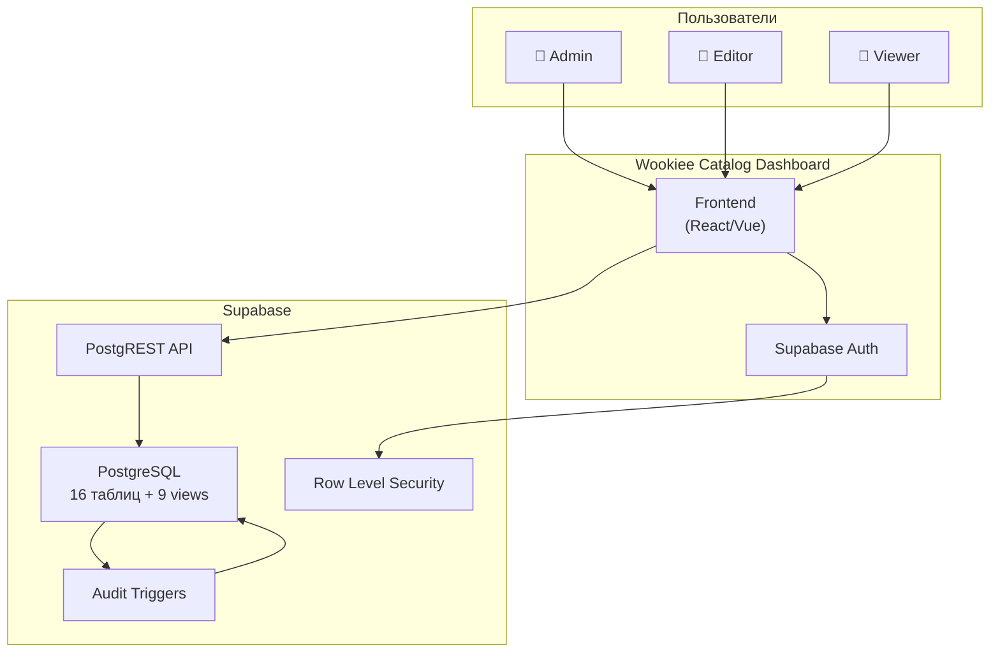

### 2.2 Data Flow — CRUD операции

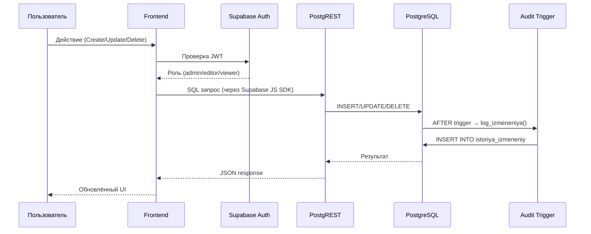

### 2.3 Компонентная архитектура

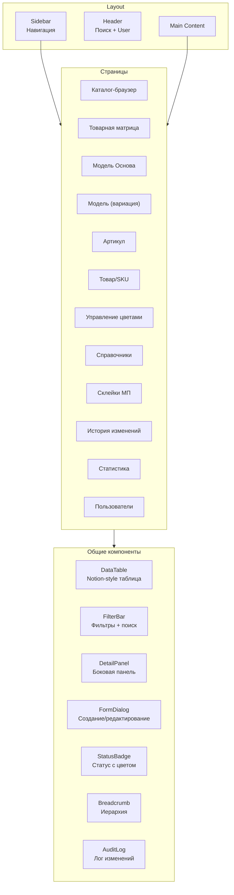

### 2.4 ER-диаграмма (полная схема)

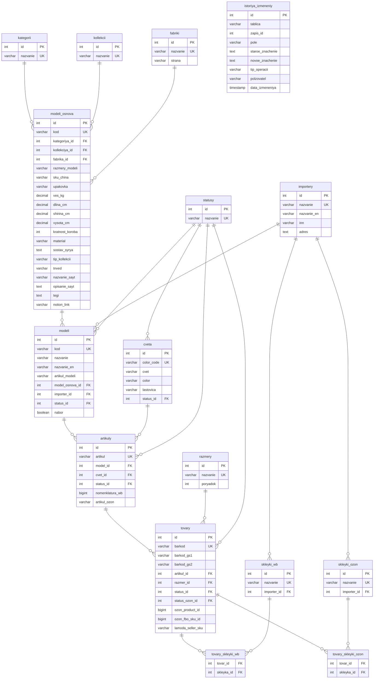

---

## 3. Модули UI

### 3.1 Каталог-браузер (главная страница)

**Назначение:** Основная таблица для навигации по каталогу — как Notion database view.

**Данные:** View `v_tovary_polnaya_info` (JOIN всех таблиц), `v_statistika_modeli_osnova`.

**Wireframe:**

```
┌─────────────────────────────────────────────────────────────┐
│ 🔍 Поиск по артикулу/баркоду/модели    [+ Создать ▾]       │
├─────────────────────────────────────────────────────────────┤
│ Уровень: [Модели основа ▾]  Статус: [Все ▾]  Коллекция: [Все ▾]  Категория: [Все ▾] │
├─────┬──────────┬──────────┬────────┬───────┬───────┬────────┤
│     │ Модель   │ Категория│Коллекц.│ Вариац│ Артик.│ Товаров│
│     │ основа   │          │        │   ий  │   ов  │        │
├─────┼──────────┼──────────┼────────┼───────┼───────┼────────┤
│  ▶  │ Vuki     │ Комплект │Трикотаж│   4   │  52   │  156   │
│  ▶  │ Moon     │ Комплект │Трикотаж│   4   │  48   │  144   │
│  ▶  │ Wendy    │ Комплект │Бесшовн.│   2   │  30   │   90   │
│  ▶  │ Joy      │ Комплект │Трикотаж│   3   │  36   │  108   │
│ ... │ ...      │ ...      │ ...    │  ...  │  ...  │  ...   │
└─────┴──────────┴──────────┴────────┴───────┴───────┴────────┘
│ 22 модели основы • 40 вариаций • 478 артикулов • 1450 SKU   │
└─────────────────────────────────────────────────────────────┘
```

**Уровни просмотра (переключатель):**
1. **Модели основа** — 22 строки, агрегация (по умолчанию)
2. **Модели (вариации)** — 40 строк
3. **Артикулы** — 478 строк
4. **Товары/SKU** — 1 450 строк

**Фильтры:**
- Статус (Продается / Выводим / Архив / ...)
- Коллекция
- Категория
- Импортер (юрлицо)
- Цвет
- Тип коллекции (tricot / seamless_wendy / seamless_audrey)

**Действия:**
- Клик по строке → DetailPanel справа
- Двойной клик → переход на страницу детали
- Раскрытие ▶ → показ дочерних записей (модели → артикулы → товары)
- [+ Создать] → FormDialog для выбранного уровня

**Сортировка:** По любой колонке, по умолчанию — по коду.

---

### 3.2 Товарная матрица (Color × Model)

**Назначение:** Pivot-таблица: по строкам — цвета, по колонкам — модели основы. Ячейка показывает наличие артикула.

**Данные:** View `v_cveta_modeli_osnova`, `v_matrica_cveta_modeli` (или динамический pivot через фронтенд).

**Wireframe:**

```
┌────────────────────────────────────────────────────────────┐
│ Товарная матрица   Коллекция: [Трикотаж ▾]  Статус: [Продается ▾] │
├──────────┬──────┬──────┬──────┬──────┬──────┬──────┬───────┤
│ Цвет     │ Vuki │ Moon │ Ruby │ Joy  │Wendy │Audrey│ Итого │
├──────────┼──────┼──────┼──────┼──────┼──────┼──────┼───────┤
│ 🟢 black │  ✓   │  ✓   │  ✓   │  ✓   │  ✓   │  ✓   │  6/6  │
│ 🟢 white │  ✓   │  ✓   │  ✓   │  ✓   │  ✓   │  ✓   │  6/6  │
│ 🟢 nude  │  ✓   │  ✓   │  ✓   │  ✓   │  ✓   │      │  5/6  │
│ 🟡 brown │  ✓   │  ✓   │      │  ✓   │  ✓   │      │  4/6  │
│ 🔴 pink  │  ✓   │      │      │      │      │      │  1/6  │
│ ...      │      │      │      │      │      │      │       │
├──────────┴──────┴──────┴──────┴──────┴──────┴──────┴───────┤
│ 🟢 Полный ряд (все модели) │ 🟡 Частичный │ 🔴 Один      │
└────────────────────────────────────────────────────────────┘
```

**Действия:**
- Клик по ✓ → переход к артикулу (модель + цвет)
- Клик по пустой ячейке → "Создать артикул для {модель} в {цвете}?"
- Фильтр по коллекции/статусу/типу коллекции
- Индикатор полноты ряда (цветовая шкала)

---

### 3.3 Модель Основа — детальная страница

**Назначение:** Полная карточка базовой модели (Vuki, Moon, Wendy...) со всеми характеристиками.

**Данные:** `modeli_osnova` + JOIN на kategorii, kollekcii, fabriki.

**Wireframe:**

```
┌────────────────────────────────────────────────────────────┐
│ ← Каталог / Vuki                          [Редактировать] │
├────────────────────────────────────────────────────────────┤
│                                                            │
│ ┌─ Основное ──────────────────────────────────────────┐    │
│ │ Код: Vuki                                            │    │
│ │ Категория: Комплект белья    Коллекция: Трикотажное  │    │
│ │ Тип коллекции: tricot        Фабрика: Singwear (CN)  │    │
│ │ Размеры: S, M, L, XL        Статус: В продаже        │    │
│ └──────────────────────────────────────────────────────┘    │
│                                                            │
│ ┌─ Характеристики ────────────────────────────────────┐    │
│ │ Для какой груди: для всех размеров                    │    │
│ │ Поддержка: средняя, мягкая    Форма чашки: без чашки  │    │
│ │ Посадка трусов: Высокая       Вид трусов: Стринги     │    │
│ │ Застежка: без застежки        Регулировка: съёмные     │    │
│ │ Назначение: каждый день, спорт  Стиль: базовое         │    │
│ │ Материал: Нейлон              Теги: Бестселлер          │    │
│ └──────────────────────────────────────────────────────┘    │
│                                                            │
│ ┌─ Состав и логистика ────────────────────────────────┐    │
│ │ Состав: 92% полиамид, 8% спандекс, ластовица 100% хл│    │
│ │ SKU CHINA: SET 66161+040    Упаковка: Basic ZIP Small │    │
│ │ Вес: 0.052 кг   Размеры: 3×15×20 см   Короб: ×10    │    │
│ │ ТНВЭД: 6212101000           Группа: Товары ИП         │    │
│ └──────────────────────────────────────────────────────┘    │
│                                                            │
│ ┌─ Контент ───────────────────────────────────────────┐    │
│ │ Для сайта: Комплект белья Вуки: топ + стринги        │    │
│ │ Описание: [длинный текст...]                          │    │
│ │ Для этикетки: Комплект нижнего белья                  │    │
│ │ Notion: 🔗 ссылка                                     │    │
│ └──────────────────────────────────────────────────────┘    │
│                                                            │
│ ┌─ Вариации (4) ──────────────────────────────────────┐    │
│ │ Vuki      │ ИП Медведева │ Продается │ 13 арт. │ 52 SKU│    │
│ │ VukiN     │ ИП Медведева │ Продается │ 12 арт. │ 48 SKU│    │
│ │ Vuki2     │ ООО Вуки     │ Продается │ 15 арт. │ 60 SKU│    │
│ │ VukiN2    │ ООО Вуки     │ Продается │ 12 арт. │ 48 SKU│    │
│ └──────────────────────────────────────────────────────┘    │
│                                                            │
│ ┌─ История изменений ─────────────────────────────────┐    │
│ │ 25.02 12:00 │ admin │ material: Нейлон → Полиамид    │    │
│ │ 24.02 15:30 │ editor│ tegi: → Бестселлер              │    │
│ └──────────────────────────────────────────────────────┘    │
└────────────────────────────────────────────────────────────┘
```

**Секции:**
1. Основное (код, категория, коллекция, фабрика, размеры, тип коллекции)
2. Характеристики (грудь, поддержка, посадка, материал, стиль, назначение и т.д.)
3. Состав и логистика (состав, SKU, упаковка, размеры, вес, ТНВЭД)
4. Контент (названия для сайта/этикетки, описания, Notion-ссылка)
5. Вариации — вложенная таблица модели
6. История изменений — из `istoriya_izmeneniy`

---

### 3.4 Модель (вариация) — детальная страница

**Назначение:** Карточка вариации модели на конкретном юрлице (напр. Vuki на ИП, Vuki2 на ООО).

**Данные:** `modeli` + JOIN на modeli_osnova, importery, statusy.

**Wireframe:**

```
┌────────────────────────────────────────────────────────────┐
│ ← Vuki / Vuki (ИП)                       [Редактировать]  │
├────────────────────────────────────────────────────────────┤
│ Код: Vuki            Название: Vuki                        │
│ Name: Vuki           Артикул модели: компбел-ж-бесшов/     │
│ Модель основа: Vuki  Импортер: ИП Медведева П.В.           │
│ Статус: Продается    Набор: Комплект нижнего белья         │
│ Рос. размер: —                                             │
├────────────────────────────────────────────────────────────┤
│ ┌─ Артикулы (13) ─────────────────────────────────────┐    │
│ │ компбел-ж-бесшов/чер   │ Black │ Продается │ 4 SKU  │    │
│ │ компбел-ж-бесшов/white │ White │ Продается │ 4 SKU  │    │
│ │ компбел-ж-бесшов/беж   │ Nude  │ Продается │ 4 SKU  │    │
│ │ ...                                                  │    │
│ └──────────────────────────────────────────────────────┘    │
│ ┌─ История изменений ─────────────────────────────────┐    │
│ └──────────────────────────────────────────────────────┘    │
└────────────────────────────────────────────────────────────┘
```

---

### 3.5 Артикул — детальная страница

**Назначение:** Карточка артикула (модель + цвет).

**Данные:** `artikuly` + JOIN на modeli, cveta, statusy.

**Wireframe:**

```
┌────────────────────────────────────────────────────────────┐
│ ← Vuki / Vuki (ИП) / компбел-ж-бесшов/чер [Редактировать] │
├────────────────────────────────────────────────────────────┤
│ Артикул: компбел-ж-бесшов/чер                              │
│ Модель: Vuki (ИП)     Цвет: Black (черный)                 │
│ Статус: Продается      WB: 18336487                        │
│ Ozon: компбел-ж-бесшов/чер_S                               │
├────────────────────────────────────────────────────────────┤
│ ┌─ Товары/SKU (4) ────────────────────────────────────┐    │
│ │ S │ 2000989949060 │ Продается │ Ozon: 756879769     │    │
│ │ M │ 2010165489006 │ Продается │ Ozon: 756879724     │    │
│ │ L │ 2037874394087 │ Продается │ Ozon: 756879708     │    │
│ │ XL│ 2037476973536 │ Продается │ Ozon: —             │    │
│ └──────────────────────────────────────────────────────┘    │
│ ┌─ Склейки ───────────────────────────────────────────┐    │
│ │ WB: ИП Склейка Vuki 1                               │    │
│ │ Ozon: —                                              │    │
│ └──────────────────────────────────────────────────────┘    │
└────────────────────────────────────────────────────────────┘
```

---

### 3.6 Товар/SKU — детальная страница

**Назначение:** Карточка конкретного товара (баркод + размер).

**Данные:** `tovary` + JOIN на artikuly, razmery, statusy, tovary_skleyki_wb/ozon.

**Wireframe:**

```
┌────────────────────────────────────────────────────────────┐
│ ← .../компбел-ж-бесшов/чер / S            [Редактировать] │
├────────────────────────────────────────────────────────────┤
│ ┌─ Баркоды ───────────────────────────────────────────┐    │
│ │ Основной: 2000989949060                              │    │
│ │ GS1: 4603777705039    GS2: 4680842784694             │    │
│ │ Переход: —                                           │    │
│ └──────────────────────────────────────────────────────┘    │
│ ┌─ Идентификаторы ────────────────────────────────────┐    │
│ │ Артикул: компбел-ж-бесшов/чер   Размер: S           │    │
│ │ Ozon Product ID: 756879769                           │    │
│ │ FBO SKU: 1319305131                                  │    │
│ │ Lamoda SKU: —         SKU China Size: SET...;S       │    │
│ └──────────────────────────────────────────────────────┘    │
│ ┌─ Статусы ───────────────────────────────────────────┐    │
│ │ WB: Продается   Ozon: Продается   Сайт: —          │    │
│ └──────────────────────────────────────────────────────┘    │
│ ┌─ Склейки ───────────────────────────────────────────┐    │
│ │ WB: ИП Склейка Vuki 1                               │    │
│ │ Ozon: ИП_склейка_Vuki                                │    │
│ └──────────────────────────────────────────────────────┘    │
└────────────────────────────────────────────────────────────┘
```

---

### 3.7 Управление цветами

**Назначение:** CRUD для таблицы `cveta` с визуализацией в каких моделях используется каждый цвет.

**Данные:** `cveta`, `v_statistika_cveta`, `v_cveta_modeli_osnova`.

**Wireframe:**

```
┌────────────────────────────────────────────────────────────┐
│ Цвета   [+ Добавить цвет]                                 │
│ Статус: [Все ▾]    В моделях: [Все ▾]                      │
├──────┬──────────┬──────────┬──────────┬────────┬───────────┤
│ Code │ Цвет     │ Color    │ Ластовица│ Статус │ Моделей   │
├──────┼──────────┼──────────┼──────────┼────────┼───────────┤
│ 2    │ черный   │ Black    │ серый    │🟢 Прод.│ 6 (Vuki…) │
│ 1    │ белый   │ White    │ белый    │🟢 Прод.│ 6 (Vuki…) │
│ 3    │ бежевый  │ Nude     │ белый    │🟢 Прод.│ 5 (Vuki…) │
│ WE009│ коричнев.│ Brown    │ серый    │🟢 Прод.│ 4 (Wendy…)│
│ ...  │          │          │          │        │           │
└──────┴──────────┴──────────┴──────────┴────────┴───────────┘
```

**Действия:**
- Добавить новый цвет
- Изменить статус (Продается / Выводим / Архив)
- Клик → детальная панель с матрицей моделей

---

### 3.8 Справочники

**Назначение:** Управление справочными таблицами. Доступно только Admin.

**Данные:** `kategorii`, `kollekcii`, `statusy`, `razmery`, `importery`, `fabriki`.

**Wireframe:**

```
┌────────────────────────────────────────────────────────────┐
│ Справочники                                                │
├────────────────────────────────────────────────────────────┤
│ ┌─ Категории (3) ──────── [+ Добавить] ──────────────┐    │
│ │ Комплект белья │ Трусы │ Боди женское               │    │
│ └──────────────────────────────────────────────────────┘    │
│ ┌─ Коллекции (7) ──────── [+ Добавить] ──────────────┐    │
│ │ Трикотажное белье без вкладышей │ Наборы трусов │ ...│    │
│ └──────────────────────────────────────────────────────┘    │
│ ┌─ Статусы (7) ────────── [+ Добавить] ──────────────┐    │
│ │ Продается │ Выводим │ Архив │ Подготовка │ ...      │    │
│ └──────────────────────────────────────────────────────┘    │
│ ┌─ Размеры (6) ────────── [+ Добавить] ──────────────┐    │
│ │ XS(1) │ S(2) │ M(3) │ L(4) │ XL(5) │ XXL(6)       │    │
│ └──────────────────────────────────────────────────────┘    │
│ ┌─ Импортеры (2) ──────── [+ Добавить] ──────────────┐    │
│ │ ИП Медведева П.В. │ ООО Вуки                        │    │
│ └──────────────────────────────────────────────────────┘    │
│ ┌─ Фабрики (1+) ──────── [+ Добавить] ──────────────┐    │
│ │ Singwear (CN)                                        │    │
│ └──────────────────────────────────────────────────────┘    │
└────────────────────────────────────────────────────────────┘
```

**Действия:** Inline-edit для простых справочников (категории, статусы, коллекции). Модальное окно для сложных (импортеры с ИНН/адресом, фабрики со страной).

---

### 3.9 Склейки маркетплейсов

**Назначение:** Управление склейками WB и Ozon. Просмотр товаров внутри склейки.

**Данные:** `skleyki_wb`, `skleyki_ozon`, `tovary_skleyki_wb`, `tovary_skleyki_ozon`.

**Wireframe:**

```
┌────────────────────────────────────────────────────────────┐
│ Склейки маркетплейсов    [WB ▾ | Ozon]    [+ Добавить]    │
│ Импортер: [Все ▾]                                          │
├──────────────────────┬──────────┬──────────┬───────────────┤
│ Название             │ Юрлицо   │ Товаров  │ Артикулов     │
├──────────────────────┼──────────┼──────────┼───────────────┤
│ ИП Склейка Vuki 1    │ ИП       │ 52       │ 13            │
│ ООО Склейка Joy 1    │ ООО      │ 36       │ 9             │
│ ООО Склейка Jelly 2  │ ООО      │ 24       │ 6             │
│ ...                  │          │          │               │
└──────────────────────┴──────────┴──────────┴───────────────┘
```

**Детальная панель склейки:**
- Список товаров внутри склейки (артикул, цвет, размер, статус)
- Добавить/удалить товар из склейки
- Переключение WB ↔ Ozon

---

### 3.10 История изменений

**Назначение:** Просмотр всех изменений в каталоге из таблицы `istoriya_izmeneniy`.

**Данные:** `istoriya_izmeneniy`.

**Wireframe:**

```
┌────────────────────────────────────────────────────────────┐
│ История изменений                                          │
│ Период: [Последние 7 дней ▾]  Таблица: [Все ▾]  Тип: [Все ▾] │
├──────────┬──────────┬────────┬──────────┬──────────────────┤
│ Дата     │ Таблица  │ Тип    │ Поле     │ Изменение        │
├──────────┼──────────┼────────┼──────────┼──────────────────┤
│ 25.02 12:│modeli_os │ UPDATE │ material │ Нейлон → Полиам. │
│ 25.02 11:│artikuly  │ INSERT │ —        │ joy/brownie      │
│ 24.02 18:│tovary    │ UPDATE │ status_id│ 3 → 1            │
│ ...      │          │        │          │                  │
└──────────┴──────────┴────────┴──────────┴──────────────────┘
```

**Фильтры:** Период, таблица, тип операции (INSERT/UPDATE/DELETE), пользователь.

---

### 3.11 Статистика / Overview

**Назначение:** Общие метрики каталога, сводка по статусам, карта заполненности.

**Данные:** `v_statistika_modeli_osnova`, `v_statistika_modeli`, `v_statistika_cveta`.

**Wireframe:**

```
┌────────────────────────────────────────────────────────────┐
│ Обзор каталога                                             │
├────────────────────────────────────────────────────────────┤
│ ┌──────────┐ ┌──────────┐ ┌──────────┐ ┌──────────┐       │
│ │    22    │ │    40    │ │   478    │ │  1 450   │       │
│ │ Моделей  │ │ Вариаций │ │ Артикулов│ │  Товаров │       │
│ └──────────┘ └──────────┘ └──────────┘ └──────────┘       │
│                                                            │
│ ┌─ По статусам ───────────────────────────────────────┐    │
│ │ 🟢 Продается: 350 (74%)  ████████████████░░░░░░    │    │
│ │ 🟡 Подготовка: 50 (11%)  ██░░░░░░░░░░░░░░░░░░░    │    │
│ │ 🔴 Архив: 48 (10%)       ██░░░░░░░░░░░░░░░░░░░    │    │
│ │ ⚪ Другие: 30 (5%)       █░░░░░░░░░░░░░░░░░░░░    │    │
│ └──────────────────────────────────────────────────────┘    │
│                                                            │
│ ┌─ По коллекциям ─────────────────────────────────────┐    │
│ │ Трикотажное белье: 4 основы, 16 вар., 192 арт.      │    │
│ │ Бесшовное Jelly:  2 основы, 4 вар., 48 арт.         │    │
│ │ ...                                                  │    │
│ └──────────────────────────────────────────────────────┘    │
│                                                            │
│ ┌─ Заполненность матрицы ─────────────────────────────┐    │
│ │ 137 цветов × 22 модели = 3 014 ячеек               │    │
│ │ Заполнено: 478 артикулов (16%)                       │    │
│ │ Полных рядов (все модели): 8 цветов                  │    │
│ └──────────────────────────────────────────────────────┘    │
└────────────────────────────────────────────────────────────┘
```

---

### 3.12 Управление пользователями (Admin only)

**Назначение:** Управление пользователями и их ролями. Только для Admin.

**Данные:** Supabase Auth (через Management API).

**Wireframe:**

```
┌────────────────────────────────────────────────────────────┐
│ Пользователи    [+ Пригласить]                             │
├────────────────┬──────────┬──────────┬─────────────────────┤
│ Email          │ Роль     │ Статус   │ Последний вход      │
├────────────────┼──────────┼──────────┼─────────────────────┤
│ admin@wookiee  │ Admin    │ Активен  │ 25.02.2026 12:00    │
│ editor1@wookiee│ Editor   │ Активен  │ 25.02.2026 10:30    │
│ viewer@wookiee │ Viewer   │ Активен  │ 24.02.2026 18:00    │
└────────────────┴──────────┴──────────┴─────────────────────┘
```

**Действия:** Пригласить пользователя (email + роль), изменить роль, деактивировать.

---

## 4. User Journeys

### 4.1 Создание нового продукта (полный flow)

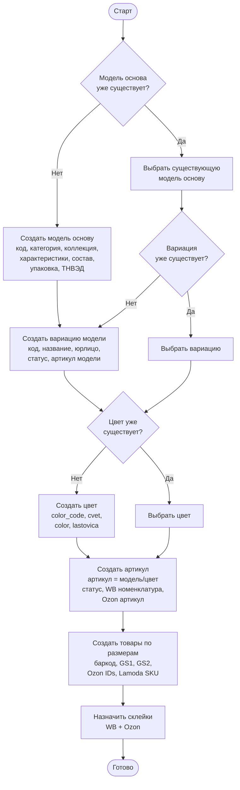

### 4.2 Редактирование существующего продукта

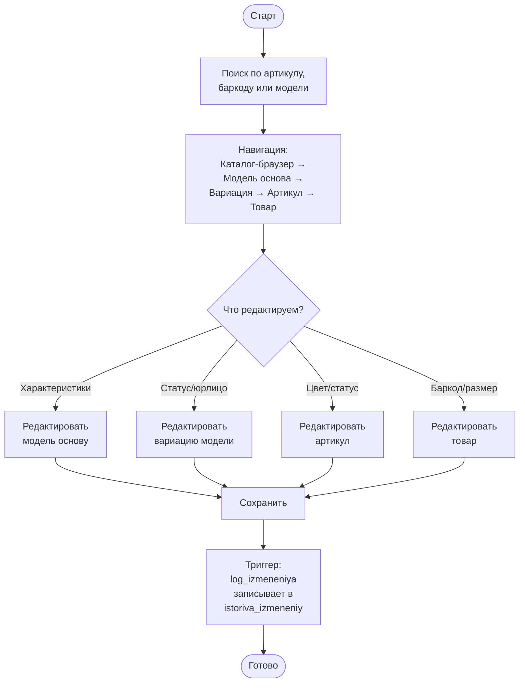

### 4.3 Управление цветами

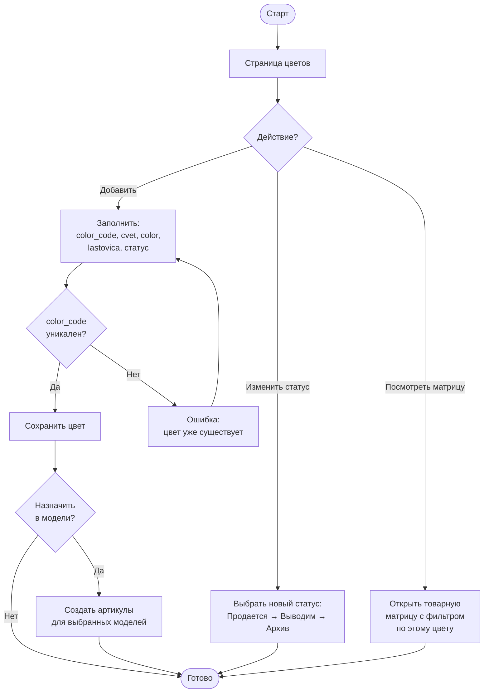

### 4.4 Управление коллекциями и категориями

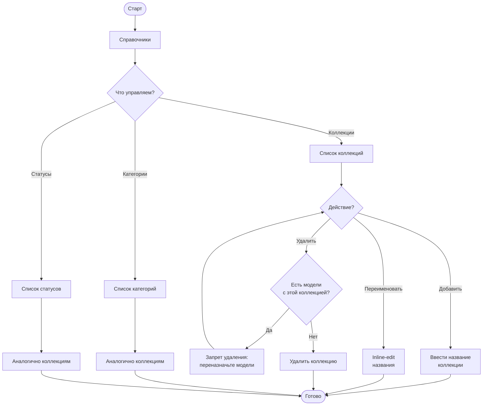

### 4.5 Управление склейками маркетплейсов

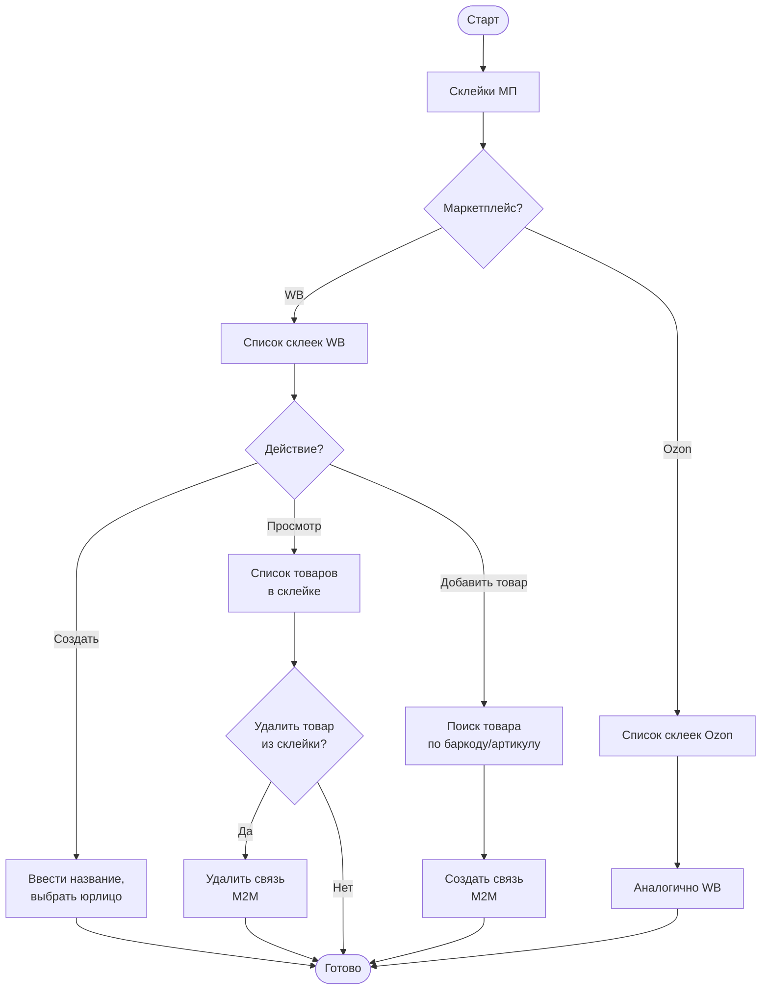

### 4.6 Поиск и фильтрация каталога

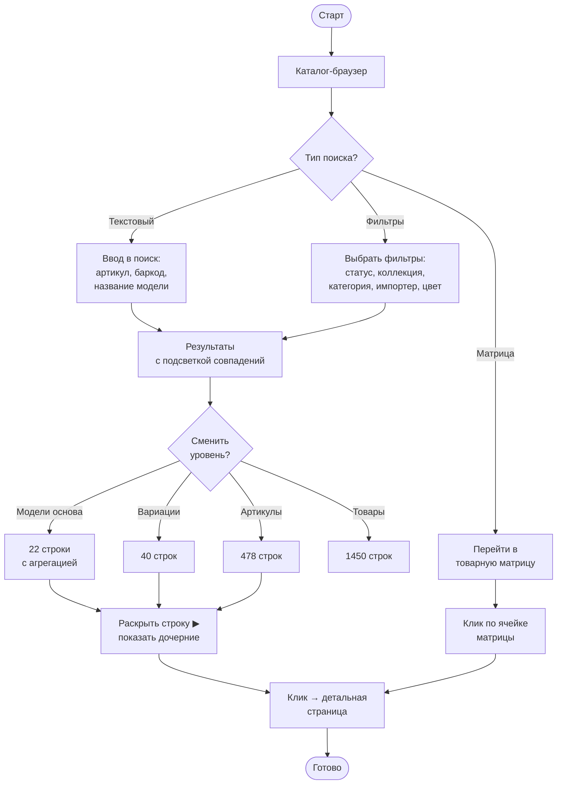

### 4.7 Просмотр товарной матрицы и закрытие пробелов

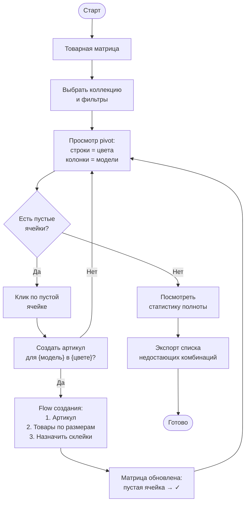

---

## 5. Роли и права доступа (RBAC)

### 5.1 Определение ролей

| Роль | Описание | Назначение |
|------|----------|------------|
| **admin** | Полный доступ | Владелец бизнеса, тех. специалист |
| **editor** | CRUD на каталожные данные | Менеджер по каталогу |
| **viewer** | Только чтение | Новые сотрудники, внешние стейкхолдеры |

### 5.2 Матрица разрешений

| Сущность | Admin | Editor | Viewer |
|----------|-------|--------|--------|
| **Модели основа** | CRUD | CRUD | R |
| **Модели (вариации)** | CRUD | CRUD | R |
| **Артикулы** | CRUD | CRUD | R |
| **Товары/SKU** | CRUD | CRUD | R |
| **Цвета** | CRUD | CRUD | R |
| **Склейки WB/Ozon** | CRUD | CRUD | R |
| **Категории** | CRUD | R | R |
| **Коллекции** | CRUD | R | R |
| **Статусы** | CRUD | R | R |
| **Размеры** | CRUD | R | R |
| **Импортеры** | CRUD | R | R |
| **Фабрики** | CRUD | R | R |
| **История изменений** | R | R | R |
| **Пользователи** | CRUD | — | — |

### 5.3 Интеграция с Supabase RLS

```sql
-- Пример RLS-политик для роли editor
CREATE POLICY "editors_can_read_all" ON modeli_osnova
    FOR SELECT TO authenticated
    USING (true);

CREATE POLICY "editors_can_modify" ON modeli_osnova
    FOR ALL TO authenticated
    USING (
        (auth.jwt() ->> 'role') IN ('admin', 'editor')
    );

-- Справочники: только admin может менять
CREATE POLICY "admin_only_modify" ON kategorii
    FOR ALL TO authenticated
    USING (
        (auth.jwt() ->> 'role') = 'admin'
    );

-- Viewer: только чтение
CREATE POLICY "viewer_read_only" ON modeli_osnova
    FOR SELECT TO authenticated
    USING (true);
```

Роль хранится в `auth.users.raw_app_meta_data ->> 'role'` или в кастомной таблице `user_roles`.

---

## 6. Workflow статусов

### 6.1 Жизненный цикл

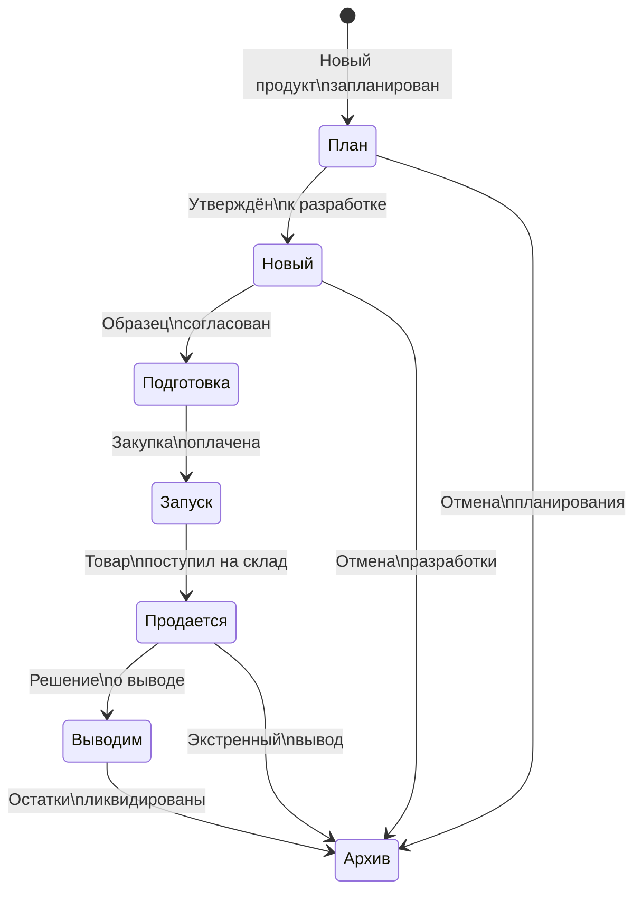

### 6.2 Правила переходов

| Из | В | Условие | Кто может |
|----|---|---------|-----------|
| — | План | Создание новой записи | admin, editor |
| План | Новый | Утверждение к разработке | admin, editor |
| Новый | Подготовка | Образец согласован | admin, editor |
| Подготовка | Запуск | Закупка оплачена | admin, editor |
| Запуск | Продается | Товар поступил | admin, editor |
| Продается | Выводим | Решение о выводе | admin |
| Выводим | Архив | Остатки ликвидированы | admin |
| Продается | Архив | Экстренный вывод | admin |
| План/Новый | Архив | Отмена | admin |

### 6.3 Массовые операции

Доступны для Admin и Editor:
- **Bulk status change:** выбрать несколько записей → изменить статус
- **Bulk assign:** назначить склейку нескольким товарам
- **Bulk create:** создать товары для нового артикула по всем размерам

---

## 7. Технические требования

### 7.1 Supabase API — используемые views и таблицы

| Модуль UI | Основной источник | Доп. источники |
|-----------|-------------------|----------------|
| Каталог-браузер (Модели основа) | `v_statistika_modeli_osnova` | — |
| Каталог-браузер (Вариации) | `v_statistika_modeli` | — |
| Каталог-браузер (Артикулы) | `v_artikuly_po_cvetam` | — |
| Каталог-браузер (Товары) | `v_tovary_polnaya_info` | — |
| Товарная матрица | `v_cveta_modeli_osnova` | `v_matrica_cveta_modeli` |
| Модель основа детали | `modeli_osnova` | kategorii, kollekcii, fabriki |
| Модель детали | `modeli` | importery, statusy, modeli_osnova |
| Артикул детали | `artikuly` | modeli, cveta, statusy |
| Товар детали | `tovary` | artikuly, razmery, statusy |
| Управление цветами | `v_statistika_cveta` | cveta |
| Склейки | `skleyki_wb`, `skleyki_ozon` | tovary_skleyki_* |
| История | `istoriya_izmeneniy` | — |
| Статистика | Все `v_statistika_*` views | — |

### 7.2 Производительность

| Требование | Решение |
|-----------|---------|
| Пагинация таблиц | Supabase `.range(from, to)` — серверная пагинация |
| Быстрый поиск | Индексы на `artikuly.artikul`, `tovary.barkod`, `modeli_osnova.kod` (уже есть) |
| Автодополнение | Debounce 300ms + `.ilike()` запрос |
| Кэширование справочников | Загрузить все справочники 1 раз при старте (< 100 записей) |
| Товарная матрица | `v_cveta_modeli_osnova` — агрегация на стороне БД, pivot на стороне фронта |

### 7.3 Валидация данных

| Поле | Правило | Уровень |
|------|---------|---------|
| `modeli_osnova.kod` | UNIQUE, NOT NULL, trim | БД + Фронт |
| `modeli.kod` | UNIQUE, NOT NULL | БД + Фронт |
| `artikuly.artikul` | UNIQUE, NOT NULL, формат: `модель/цвет` | БД + Фронт |
| `tovary.barkod` | UNIQUE, NOT NULL, 13 цифр | БД + Фронт |
| `cveta.color_code` | UNIQUE, NOT NULL | БД + Фронт |
| `statusy.nazvanie` | UNIQUE, NOT NULL | БД |
| FK-ссылки | Существование записи в целевой таблице | БД (REFERENCES) |
| `tip_kollekcii` | CHECK IN ('tricot', 'seamless_wendy', 'seamless_audrey') | БД |

### 7.4 Миграция с Google Sheets (фазовый переход)

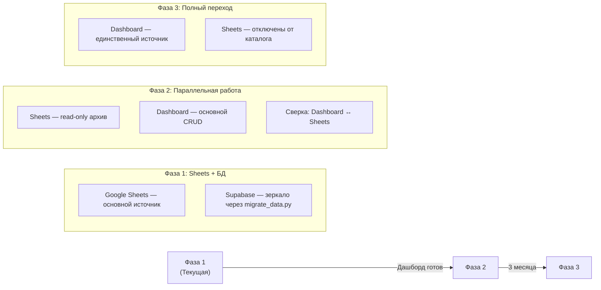

**Фаза 1 (текущая):** Sheets = source of truth, БД = зеркало
**Фаза 2:** Дашборд работает параллельно, команда учится, сверка данных
**Фаза 3:** Дашборд = source of truth, Sheets архивированы

---

## Навигация по дашборду (Sitemap)

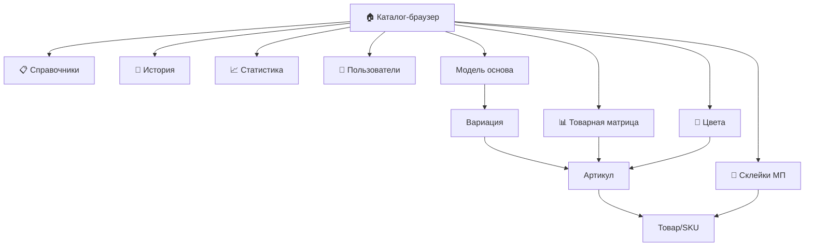
