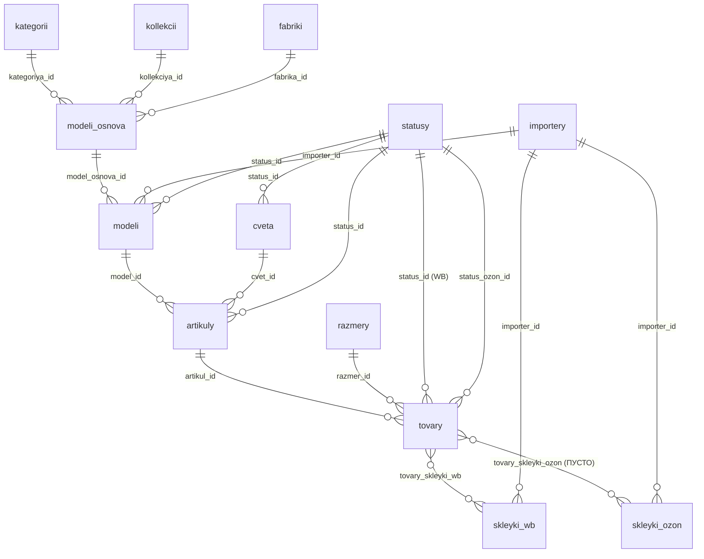

# Аудит БД: Google Sheets vs Supabase

> **Дата:** 2026-02-25
> **Источник данных:** Google Sheets (`19Nbr0kD8JJlwd7OCIMbM9qxucYNjmXnWtwJUgXv0vlg`)
> **БД:** Supabase PostgreSQL (16 таблиц, 9 views)
> **Маппинг:** `sku_database/config/mapping.py`
> **Импорт:** `sku_database/scripts/migrate_data.py`

---

## 1. Резюме

### Масштаб данных

| Источник | Кол-во |
|----------|--------|
| Листы Google Sheets (всего) | 36+ |
| Листы с данными каталога | 7 |
| Таблицы Supabase | 16 |
| Views Supabase | 9 |
| Строки в "Все модели" | 191 |
| Строки в "Все товары" | 4 789 |
| Строки в "Все артикулы" | 193 |
| Строки в "Аналитики цветов" | 165 |
| Строки в "Упаковки" | 13 |
| Строки в "Склейки WB" | 556 |
| Строки в "Склейки Озон" | 1 406 |

### Сводка по статусу импорта

| Лист | Импортируется? | Целевые таблицы | Статус |
|------|----------------|-----------------|--------|
| Все модели | **Да** | modeli_osnova, modeli, kategorii, kollekcii, importery, fabriki | Частичный — 30 из 90 колонок |
| Все товары | **Да** | tovary, artikuly, skleyki_wb, razmery, statusy | Частичный — 17 из 88 колонок |
| Аналитики цветов | **Да** | cveta | Полный — 5 из 5 каталожных колонок |
| Все артикулы | **Нет** | (artikuly) | Не используется — артикулы создаются из "Все товары" |
| Упаковки | **Нет** | (нет отдельной таблицы) | Только имя упаковки через "Все модели" |
| Склейки WB | **Частично** | skleyki_wb | Только имена склеек из "Все товары", не из этого листа |
| Склейки Озон | **Нет** | skleyki_ozon (пустая) | КРИТИЧНО: таблица есть, данные нет |

### Критические проблемы

| # | Проблема | Критичность |
|---|----------|-------------|
| A-01 | **Склейки Озон НЕ импортируются.** Таблица `skleyki_ozon` существует, но пуста. Нет маппинга, нет метода импорта | CRITICAL |
| A-02 | **Лист "Все артикулы" НЕ используется.** Артикулы создаются из "Все товары". Лист содержит агрегированные финансовые метрики — потенциально другой источник | HIGH |
| A-03 | **~60 колонок из Sheets не имеют аналога в БД** (ценообразование, финансы, инвентарь, компонентные SKU, сертификаты) | MEDIUM |
| A-04 | **Лист "Склейки WB" импортируется косвенно** — только имена склеек из "Все товары", а не из самого листа (252 колонки с рейтингами/отзывами) | MEDIUM |
| A-05 | **Лист "Упаковки" НЕ импортируется** как отдельная сущность. Цены, размеры и ссылки на файлы упаковок теряются | LOW |

---

## 2. По-листовой анализ

### 2.1 Лист "Все модели" (90 колонок, 191 строк)

Этот лист — основной источник для таблиц `modeli_osnova` и `modeli`. Каждая модель основа имеет одну "главную" строку с характеристиками и несколько строк-размеров.

#### Импортируемые колонки (30)

| Колонка Sheets | → Таблица БД | Поле БД | Статус |
|----------------|-------------|---------|--------|
| (col 0: код модели) | modeli | kod | ✅ OK |
| Название модели | modeli | nazvanie | ✅ OK |
| Name | modeli | nazvanie_en | ✅ OK |
| Размеры модели | modeli_osnova | razmery_modeli | ✅ OK |
| Российский размер | modeli | rossiyskiy_razmer | ✅ OK |
| Статус | modeli | status_id (FK → statusy) | ✅ OK (с маппингом старых имён) |
| Артикул модели | modeli | artikul_modeli | ✅ OK |
| Модель основа | modeli | model_osnova_id (FK → modeli_osnova) | ✅ OK |
| Категория | modeli_osnova | kategoriya_id (FK → kategorii) | ✅ OK |
| Набор | modeli | nabor (boolean) | ✅ OK |
| Коллекция | modeli_osnova | kollekciya_id (FK → kollekcii) | ✅ OK |
| Теги | modeli_osnova | tegi | ✅ OK |
| Посадка трусов | modeli_osnova | posadka_trusov | ✅ OK |
| Вид трусов | modeli_osnova | vid_trusov | ✅ OK |
| Для какой груди | modeli_osnova | dlya_kakoy_grudi | ✅ OK |
| Степень поддержки груди... | modeli_osnova | stepen_podderzhki | ✅ OK |
| Форма чашки | modeli_osnova | forma_chashki | ✅ OK |
| Регулировка | modeli_osnova | regulirovka | ✅ OK |
| Застежка | modeli_osnova | zastezhka | ✅ OK |
| Назначение | modeli_osnova | naznachenie | ✅ OK |
| Стиль | modeli_osnova | stil | ✅ OK |
| По настроению | modeli_osnova | po_nastroeniyu | ✅ OK |
| Материал | modeli_osnova | material | ✅ OK |
| Состав сырья | modeli_osnova | sostav_syrya | ✅ OK |
| Composition | modeli_osnova | composition | ✅ OK |
| Название для сайта | modeli_osnova | nazvanie_sayt | ✅ OK |
| Описание для сайта | modeli_osnova | opisanie_sayt | ✅ OK |
| Название для Этикетки | modeli_osnova | nazvanie_etiketka | ✅ OK |
| Details | modeli_osnova | details | ✅ OK |
| Description | modeli_osnova | description | ✅ OK |
| SKU CHINA | modeli_osnova | sku_china | ✅ OK |
| Упаковка | modeli_osnova | upakovka | ✅ OK |
| Вес (кг) | modeli_osnova | ves_kg | ✅ OK |
| Длина | modeli_osnova | dlina_cm | ✅ OK |
| Ширина | modeli_osnova | shirina_cm | ✅ OK |
| Высота | modeli_osnova | vysota_cm | ✅ OK |
| Кратность короба | modeli_osnova | kratnost_koroba | ✅ OK |
| Срок производства | modeli_osnova | srok_proizvodstva | ✅ OK |
| Комплектация | modeli_osnova | komplektaciya | ✅ OK |
| ТНВЭД | modeli_osnova | tnved | ✅ OK |
| Группа | modeli_osnova | gruppa_sertifikata | ✅ OK |
| Ссылка на ноушн | modeli_osnova | notion_link | ✅ OK |
| Импортер | modeli | importer_id (FK) + importery | ✅ OK |
| Importer | importery | nazvanie_en | ✅ OK |
| ИНН | importery | inn | ✅ OK |
| Адрес импортера | importery | adres | ✅ OK |
| Фабрика | modeli_osnova | fabrika_id (FK) + fabriki | ✅ OK |
| Страна производства | fabriki | strana | ✅ OK |

#### НЕ импортируемые колонки (60)

**Каталожно-релевантные (отсутствуют в БД, потенциально важны для дашборда):**

| Колонка Sheets | Описание | Категория |
|----------------|----------|-----------|
| В каталог Для маленькой груди | Подходит ли для маленькой груди (да/нет) | Характеристики |
| В каталог Для средней груди | Подходит ли для средней груди (да/нет) | Характеристики |
| В каталог Для большой груди | Подходит ли для большой груди (да/нет) | Характеристики |
| В каталог "Степень поддержки" ×5 | 5 булевых: средняя/мягкая/крепкая/усиленная/выше среднего | Характеристики |
| Майк | SKU майки в комплекте (напр. "040") | Компонентные SKU |
| Трусы | SKU трусов в комплекте (напр. "66161") | Компонентные SKU |
| Гигиеническая ластовица | Есть/нет гигиеническая ластовица | Характеристики |
| лого | Описание лого (напр. "4 cm wookiee") | Характеристики |
| Товарный знак | Торговая марка (напр. "Wookiee") | Юридическое |
| Сертификат | Название сертификата | Юридическое |
| Срок действия | Срок действия сертификата | Юридическое |
| Price | Закупочная цена (CNY) | Ценообразование |
| Объем | Объём упаковки (расчётное L×W×H/1000) | Логистика |
| Name for packing list | Название для упаковочного листа (EN) | Экспорт/Печать |
| Name for Invoice | Название для инвойса (EN) | Экспорт/Печать |

**Финансово-операционные (агрегируются из других источников, не для каталожной БД):**

| Колонка Sheets | Описание | Категория |
|----------------|----------|-----------|
| Цена РРЦ сайт | РРЦ для сайта | Ценообразование |
| Цена РРЦ сайт скидка | РРЦ со скидкой | Ценообразование |
| Цена WB MIN | Минимальная цена WB | Ценообразование |
| Цена РРЦ OZON при ДРР 15% | РРЦ для OZON | Ценообразование |
| Цена OZON MIN | Минимальная цена OZON | Ценообразование |
| Ср чек МП | Средний чек маркетплейсов | Финансы |
| Средний чек до СПП | Средний чек до СПП | Финансы |
| Себес мой склад | Себестоимость по МойСклад | Финансы |
| Себес фин данные | Себестоимость по Фин данным | Финансы |
| Маржинальная прибыль | Маржинальная прибыль | Финансы |
| Маржинальность до СПП | % маржинальности | Финансы |
| Маржа без ДРР | Маржа без расходов на рекламу | Финансы |
| ДРР итого | Доля рекламных расходов | Финансы |
| Выкупаемость | % выкупаемости | Финансы |
| Логистика МП на ед. | Логистика на единицу | Финансы |
| Прочие расходы МП на ед. | Прочие расходы на единицу | Финансы |

**Намеренно пропущенные (помечены "не нужно" в Sheets):**

| Колонка Sheets | Причина |
|----------------|---------|
| Краткое описание (не нужно) | Помечено как ненужное |
| Описание (свойства, характеристики, уход) (не нужно) | Помечено как ненужное |
| Характеристики (не нужно) | Помечено как ненужное |

---

### 2.2 Лист "Все товары" (88 колонок, 4 789 строк)

Основной источник для таблиц `tovary`, `artikuly`, `skleyki_wb`, `razmery`, `statusy`.

#### Импортируемые колонки (17)

| Колонка Sheets | → Таблица БД | Поле БД | Статус |
|----------------|-------------|---------|--------|
| БАРКОД | tovary | barkod | ✅ OK |
| БАРКОД GS1 | tovary | barkod_gs1 | ✅ OK |
| БАРКОД GS2 | tovary | barkod_gs2 | ✅ OK |
| БАРКОД ПЕРЕХОД | tovary | barkod_perehod | ✅ OK |
| Артикул | artikuly | artikul (создаёт запись) | ✅ OK |
| Модель | artikuly | model_id (FK via lookup) | ✅ OK |
| Color code | artikuly | cvet_id (FK via lookup) | ✅ OK |
| Нуменклатура | artikuly | nomenklatura_wb | ✅ OK |
| Статус товара | tovary | status_id (FK) | ✅ OK |
| Статус товара OZON | tovary | status_ozon_id (FK) | ✅ OK |
| Ozon Product ID | tovary | ozon_product_id | ✅ OK |
| FBO OZON SKU ID | tovary | ozon_fbo_sku_id | ✅ OK |
| Seller SKU Lamoda | tovary | lamoda_seller_sku | ✅ OK |
| SKU CHINA SIZE | tovary | sku_china_size | ✅ OK |
| Размер | tovary | razmer_id (FK via lookup) | ✅ OK |
| Артикул Ozon | artikuly | artikul_ozon | ✅ OK |
| Склейка на WB | tovary_skleyki_wb | M2M связь | ✅ OK |

#### Денормализованные колонки (не импортируются — уже есть через FK)

| Колонка Sheets | Источник в БД | Примечание |
|----------------|--------------|------------|
| Артикул модели | modeli.artikul_modeli | Через artikuly → modeli |
| Сolor | cveta.color | Через artikuly → cveta |
| Цвет | cveta.cvet | Через artikuly → cveta |
| ТНВЭД | modeli_osnova.tnved | Через цепочку FK |
| Категория | kategorii.nazvanie | Через modeli_osnova → kategorii |
| Модель основа | modeli_osnova.kod | Через modeli → modeli_osnova |
| Коллекция | kollekcii.nazvanie | Через modeli_osnova → kollekcii |
| Состав сырья | modeli_osnova.sostav_syrya | Через FK |
| SKU CHINA | modeli_osnova.sku_china | Через FK |
| Name | modeli.nazvanie_en | Через FK |
| Упаковка | modeli_osnova.upakovka | Через FK |
| Details | modeli_osnova.details | Через FK |
| Фабрика | fabriki.nazvanie | Через FK |
| Импортер | importery.nazvanie | Через FK |
| Importer | importery.nazvanie_en | Через FK |
| Адрес Импортера | importery.adres | Через FK |
| Название для Этикетки | modeli_osnova.nazvanie_etiketka | Через FK |
| Вес (кг) | modeli_osnova.ves_kg | Через FK |
| Длина, Ширина, Высота | modeli_osnova.dlina_cm/shirina_cm/vysota_cm | Через FK |
| Кратность короба | modeli_osnova.kratnost_koroba | Через FK |
| Объем | Расчётное | L×W×H/1000 |
| Composition | modeli_osnova.composition | Через FK |
| Группа | modeli_osnova.gruppa_sertifikata | Через FK |
| Название для сайта | modeli_osnova.nazvanie_sayt | Через FK |
| Краткое описание | — | Помечено "не нужно" в Все модели |
| Описание (свойства...) | modeli_osnova.opisanie_sayt | Через FK |
| Характеристики | — | Помечено "не нужно" |
| Теги | modeli_osnova.tegi | Через FK |
| Посадка трусов | modeli_osnova.posadka_trusov | Через FK |
| Вид трусов | modeli_osnova.vid_trusov | Через FK |
| Для какой груди | modeli_osnova.dlya_kakoy_grudi | Через FK |

#### НЕ импортируемые колонки (уникальные данные, отсутствуют в БД)

**Каталожно-релевантные:**

| Колонка Sheets | Описание | Категория |
|----------------|----------|-----------|
| Crotch | Тип ластовицы на уровне товара | Характеристики |
| Статус товара Сайт | Статус для сайта (напр. "Архив") | Многоканальные статусы |
| Статус товара Ламода | Статус для Lamoda | Многоканальные статусы |
| Импортер с датой | "ИП Медведева П.В. Дата изготовления: 02.2025" | Этикетки/Печать |
| Price | Закупочная цена (CNY) на уровне размера | Ценообразование |
| Формула для даты изготовления | Сгенерированная строка для этикетки | Этикетки/Печать |

**Ценообразование (не в каталожной БД):**

| Колонка Sheets | Описание |
|----------------|----------|
| Цена РРЦ сайт | Рекомендованная розничная цена для сайта |
| Цена РРЦ сайт скидка | РРЦ со скидкой |
| Цена MIN | Минимальная цена продажи |

**Финансы/Аналитика (агрегированные, не для каталожной БД):**

| Колонка Sheets |
|----------------|
| Себестоимость Склад, Себестоимость PB |
| Средний чек до СПП, Средний чек после СПП |
| Средние заказы PB, Выкупаемость |
| Маржинальная прибыль, Маржинальность до СПП |
| Логистика на ед., Ост. расходы на ед., НДС на ед., Реклама на ед. |
| Маржа без ДРР, ДРР итого, ДРР внутр, ДРР внеш |
| Оборачиваемость |

**Инвентарь (оперативные данные, не для каталожной БД):**

| Колонка Sheets |
|----------------|
| Наличие офис |
| Наличие офис (Без приемки) |
| Наличие в пути |
| Наличие WB |
| Наличие WB возвраты |
| Наличие Ozon |
| Наличие итого |

---

### 2.3 Лист "Все артикулы" (35 колонок, 193 строки)

**Статус: НЕ ИСПОЛЬЗУЕТСЯ при импорте.**

`MAPPING_ARTIKULY` был удалён из `mapping.py` (Phase 0 Cleanup), т.к. никогда не импортировался в `migrate_data.py`. Артикулы создаются из листа "Все товары".

#### Содержимое листа

| Колонка Sheets | Есть в БД? | Примечание |
|----------------|-----------|------------|
| Артикул | ✅ artikuly.artikul | Импорт из "Все товары" |
| Модель | ✅ artikuly → modeli | Через FK |
| Нуменклатура | ✅ artikuly.nomenklatura_wb | Импорт из "Все товары" |
| Артикул Ozon | ✅ artikuly.artikul_ozon | Импорт из "Все товары" |
| Статус товара | ✅ artikuly.status_id | Импорт из "Все товары" |
| Средние заказы | ❌ | Агрегированная метрика |
| Маржинальная прибыль | ❌ | Финансы |
| Маржинальность | ❌ | Финансы |
| Себестоимость | ❌ | Финансы |
| Средний чек до СПП | ❌ | Финансы |
| Выкупаемость | ❌ | Финансы |
| Логистика на ед. | ❌ | Финансы |
| Ост. расходы на ед. | ❌ | Финансы |
| Комиссия на ед. | ❌ | Финансы |
| НДС на ед. | ❌ | Финансы |
| Реклама на ед. | ❌ | Финансы |
| Маржа без ДРР | ❌ | Финансы |
| Оборачиваемость | ❌ | Операционные |
| Наличие итого | ❌ | Инвентарь |
| Наличие WB | ❌ | Инвентарь |
| Наличие офис (Без приемки) | ❌ | Инвентарь |
| Цена WB | ❌ | Ценообразование |

**Вывод:** Лист дублирует данные из "Все товары" (5 каталожных колонок) + добавляет агрегированные финансовые метрики. Для каталожной БД не нужен.

---

### 2.4 Лист "Аналитики цветов" (57 колонок, 165 строк)

#### Импортируемые колонки (5)

| Колонка Sheets | → Таблица БД | Поле БД | Статус |
|----------------|-------------|---------|--------|
| Color code | cveta | color_code | ✅ OK (UNIQUE) |
| Цвет | cveta | cvet | ✅ OK |
| Сolor | cveta | color | ✅ OK |
| Gusset | cveta | lastovica | ✅ OK |
| Статус | cveta | status_id (FK) | ✅ OK |

#### НЕ импортируемые колонки (52)

**Каталожно-релевантные:**

| Колонка Sheets | Описание | Потенциально для БД? |
|----------------|----------|---------------------|
| Agreed | Согласован ли цвет (TRUE/FALSE) | Да — булево поле |
| Решения | Бизнес-решения по цвету (текст) | Возможно — заметки |
| Модели Продаются | В каких моделях продаётся | Нет — производное от данных |

**Аналитические (производные, по моделям):**

| Колонка Sheets | Описание |
|----------------|----------|
| Средние заказы (×4 модели: Vuki, Moon, Ruby, Joy) | Финансы, по моделям |
| Маржинальная прибыль (×4 модели) | Финансы |
| Маржинальность (×4 модели) | Финансы |
| Конверсия | Финансы |
| Кол-во моделей | Производное |
| Ср. заказы на модель | Производное |
| Ср. маржинальная прибыль | Производное |
| "Что будет если будет MAX цветов" ×2 | Аналитическая модель |
| Можно добавить моделей | Аналитическая модель |
| Сколько можно дозаработать | Аналитическая модель |

---

### 2.5 Лист "Упаковки" (7 колонок, 13 строк)

**Статус: НЕ ИМПОРТИРУЕТСЯ как отдельная сущность.**

Поле `modeli_osnova.upakovka` хранит только НАЗВАНИЕ упаковки (напр. "Basic ZIP Pack Small"), но не её характеристики.

| Колонка Sheets | Есть в БД? | Примечание |
|----------------|-----------|------------|
| Название | ✅ Частично | Через modeli_osnova.upakovka (только имя, не FK) |
| Price, cny | ❌ | Закупочная цена упаковки |
| Длина, см | ❌ | Размеры упаковки |
| Ширина, см | ❌ | Размеры упаковки |
| Высота, см | ❌ | Размеры упаковки |
| Объем, л | ❌ | Расчётный объём |
| Ссылка на файл | ❌ | Google Drive ссылка на дизайн |

**Примечание:** В `modeli_osnova` поля `dlina_cm`, `shirina_cm`, `vysota_cm` относятся к размерам ТОВАРА, а не упаковки. Размеры упаковки — это отдельные данные.

---

### 2.6 Лист "Склейки WB" (252 колонки, 556 строк)

**Статус: ЧАСТИЧНО ИМПОРТИРУЕТСЯ (косвенно).**

Склейки WB создаются в `migrate_data.py` из колонки "Склейка на WB" листа "Все товары", а не из этого листа напрямую.

#### Косвенно импортируемые данные

| Данные | Источник | → БД | Статус |
|--------|----------|------|--------|
| Название склейки | "Все товары" col "Склейка на WB" | skleyki_wb.nazvanie | ✅ |
| Юрлицо | Выводится из названия ("ИП"/"ООО") | skleyki_wb.importer_id | ✅ |

#### НЕ импортируемые колонки из листа "Склейки WB"

**Каталожно-релевантные (уникальные данные этого листа):**

| Колонка Sheets | Описание |
|----------------|----------|
| Арт ВБ | Артикул WB (цифровой ID карточки) |
| Остатки | Наличие на складе (текст "Есть"/"Нет") |
| Ярлыки | Ярлыки на WB (напр. "joy, в продаже") |
| Теги | Теги карточки на WB |
| Таблица размеров | Какая таблица размеров (напр. "Джой") |
| Закреп.отзыв | Есть ли закреплённый отзыв (Да/Нет) |
| Цена продавца до скидки | Текущая цена продавца |
| Скидка продавца | Размер скидки |
| Цена со скидкой | Цена после скидки |
| Скидка клуба WB | Размер скидки WB Club |

**Рейтинги и отзывы (~200 колонок):**

Лист содержит историю рейтингов и количества отзывов по 5-балльным оценкам (5★, 4★, 3★, 2★, 1★) с еженедельной гранулярностью за период июнь 2025 — февраль 2026. Каждая дата — 6 колонок (рейтинг, 5★, 4★, 3★, 2★, 1★).

**Финансовые (по артикулам WB):**

| Колонка Sheets |
|----------------|
| маржа, маржинальность |
| Доля себес %, Доля логистики % |
| ДРР % |
| статус, abc |
| Средние заказы, Маржинальная прибыль, Маржинальность |

---

### 2.7 Лист "Склейки Озон" (22 колонки, 1 406 строк)

**Статус: НЕ ИМПОРТИРУЕТСЯ. КРИТИЧЕСКАЯ ПРОБЛЕМА.**

Таблица `skleyki_ozon` существует в schema.sql, но:
- `MAPPING_SKLEYKI_OZON` отсутствует в `mapping.py`
- `migrate_data.py` не содержит метод `_migrate_skleyki_ozon()`
- Таблица `skleyki_ozon` в БД пуста
- Таблица `tovary_skleyki_ozon` (M2M) также пуста

| Колонка Sheets | Потенциальный маппинг | Статус |
|----------------|----------------------|--------|
| (col 0: юрлицо) | skleyki_ozon.importer_id (FK) | ❌ Не маппится |
| Склейкообразующий признак | skleyki_ozon.nazvanie | ❌ Не маппится |
| (col 2: порядок) | — | ❌ |
| Артикул Озон | artikuly.artikul_ozon (для связи) | ❌ Не маппится |
| СКУ Озон | tovary.ozon_fbo_sku_id (для связи) | ❌ Не маппится |
| Модель | — | Денормализовано |
| Предмет | — | Денормализовано |
| Статус товара | — | Денормализовано |
| Остатки на складе | ❌ | Нет в БД |
| Контент-рейтинг | ❌ | Нет в БД |
| Фото | ❌ | Нет в БД |
| Видео | ❌ | Нет в БД |
| Рич | ❌ | Нет в БД |
| Таблица размеров | ❌ | Нет в БД |
| Рейтинг | ❌ | Нет в БД |
| Цена план | ❌ | Нет в БД |
| Цена до скидки | ❌ | Нет в БД |
| Наша цена | ❌ | Нет в БД |
| Дельта: план/наша | ❌ | Расчётное |
| Остаток на складах Озон | ❌ | Нет в БД |

---

## 3. Обратный аудит: поля БД без источника в Sheets

Поля, которые существуют в БД, но не имеют прямого источника в Google Sheets.

| Таблица | Поле | Описание | Источник |
|---------|------|----------|----------|
| modeli_osnova | tip_kollekcii | Тип коллекции (tricot/seamless_wendy/seamless_audrey) | Добавлено миграцией 001, заполняется вручную |
| modeli_osnova | created_at, updated_at | Служебные | Автоматически |
| modeli | created_at, updated_at | Служебные | Автоматически |
| artikuly | created_at, updated_at | Служебные | Автоматически |
| tovary | created_at, updated_at | Служебные | Автоматически |
| cveta | created_at, updated_at | Служебные | Автоматически |
| skleyki_wb | created_at, updated_at | Служебные | Автоматически |
| skleyki_ozon | * (все поля) | Таблица пуста | НЕТ ИМПОРТА |
| tovary_skleyki_ozon | * (все поля) | Таблица пуста | НЕТ ИМПОРТА |
| istoriya_izmeneniy | * (все поля) | Журнал аудита | Триггеры |

**Все остальные поля БД имеют корректный источник в Google Sheets.**

---

## 4. Проблемы целостности данных

### 4.1 Несоответствия масштаба

| Метрика | Google Sheets | Supabase БД | Дельта | Причина |
|---------|--------------|-------------|--------|---------|
| Модели основа | ~22 (уникальные "Модель основа") | 22 | ✅ OK | — |
| Модели (вариации) | ~40 (уникальные "Unnamed: 0") | 40 | ✅ OK | — |
| Артикулы | 193 (лист "Все артикулы") | 478 | ⚠️ +285 | В "Все товары" больше уникальных артикулов, чем в "Все артикулы" |
| Товары | 4 789 (лист "Все товары") | ~1 450 | ⚠️ −3 339 | migrate_data.py фильтрует дубликаты баркодов + ошибки парсинга |
| Цвета | 165 (лист "Аналитики цветов") | 137 | ⚠️ −28 | Часть строк в Sheets — пустые или невалидные color_code |
| Склейки WB | ~25 (уникальные в "Все товары") | 25 | ✅ OK | — |
| Склейки Ozon | 1 406 строк, ~20 склеек | 0 | 🔴 ПУСТО | Нет импорта |

### 4.2 Потенциальные проблемы маппинга

| # | Проблема | Описание |
|---|----------|----------|
| D-01 | **Модели ищутся по названию И по коду** | `migrate_data.py` добавляет оба ключа в `self._modeli`, но при конфликте имён между кодом и названием возможна путаница |
| D-02 | **Артикулы 478 vs 193** | В БД больше артикулов, чем в листе "Все артикулы", потому что артикулы создаются из "Все товары" (где больше уникальных комбинаций Артикул) |
| D-03 | **Товары 1 450 vs 4 789** | Значительная дельта. Скорее всего: листы содержат строки с пустыми баркодами, дубликаты, или строки с невалидными данными |
| D-04 | **Цвет ищется по color_code** | Если в "Все товары" встречается color_code, которого нет в "Аналитики цветов", артикул создаётся с `cvet_id=NULL` |

### 4.3 Хардкод в views

**`v_matrica_cveta_modeli`** содержит хардкод 11 из 22 моделей основы:

```sql
MAX(CASE WHEN mo.kod = 'Vuki' THEN '✓' ELSE '' END) AS "Vuki",
MAX(CASE WHEN mo.kod = 'Moon' THEN '✓' ELSE '' END) AS "Moon",
-- ... только 11 моделей из 22
```

Отсутствуют: Valery, Miafull, Bella, Lana, Eva, Charlotte, Jess, Duo, Mia, Angelina, Set Wendy.

---

## 5. Иерархия и FK-связи

### ER-диаграмма (текущее состояние)



### Цепочка создания нового продукта

```
1. Справочники: kategorii, kollekcii, fabriki, importery, razmery, statusy
2. cveta → color_code уникален
3. modeli_osnova → kod уникален, FK на kategorii/kollekcii/fabriki
4. modeli → kod уникален, FK на modeli_osnova/importery/statusy
5. artikuly → artikul уникален, FK на modeli/cveta/statusy
6. tovary → barkod уникален, FK на artikuly/razmery/statusy
7. tovary_skleyki_wb → M2M (tovar_id + skleyka_id)
8. tovary_skleyki_ozon → M2M (НЕ ЗАПОЛНЯЕТСЯ)
```

---

## 6. Операционные листы (не для каталожной БД)

Следующие листы содержат финансовые, аналитические и операционные данные, которые НЕ являются частью каталожной БД. Они уже обрабатываются другими подсистемами Wookiee (ETL маркетплейсов, финансовый агент Олег).

| Лист | Строки | Назначение | Обрабатывается |
|------|--------|-----------|----------------|
| Фин данные | 1 051 | Финансовый отчёт по баркодам за 2 периода | Агент Олег |
| Фин данные NEW | 5 290 | Новый формат фин. данных | Агент Олег |
| ABC анализ | 156 | ABC-классификация по артикулам | scripts/abc_analysis.py |
| Расчет цены | 37 | Калькулятор ценообразования | Ручной инструмент |
| Дубли с ИП на ООО | 77 | Карта миграции артикулов между юрлицами | Ручной инструмент |
| Аналитика по запросам | 261 | Поисковая аналитика WB | Маркетинг |
| Шаблон для этикетки | 89 | Генерация этикеток | Печать |
| Шаблон Мой склад | 118 | Синхронизация с МойСклад | services/sheets_sync/ |
| Проверка | 1 501 | Сверка данных между МП | Ручной инструмент |
| Шаблон для Поставлено | — | Шаблон поставок | Ручной |
| МойСклад_АПИ | 1 488 | API данные МойСклад | services/sheets_sync/ |
| Ozon остатки и цены | 1 429 | Остатки и цены Ozon | Оперативные |
| WB остатки | 911 | Остатки WB | Оперативные |
| WB цены | 506 | Цены WB | Оперативные |
| Отзывы ООО/ИП | 774/400 | Отзывы клиентов | Маркетинг |
| Для сайта | 1 001 | Данные для сайта | Контент |
| Статус синхронизации | — | Панель управления синхронизацией | services/sheets_sync/ |
| *_TEST | — | Тестовые копии | Dev |

---

## 7. Выводы

### Что работает хорошо
1. **Иерархия 4 уровней** (modeli_osnova → modeli → artikuly → tovary) — корректно отражает бизнес-модель
2. **Справочники** (kategorii, kollekcii, statusy, razmery, importery, fabriki) — полностью заполнены
3. **Цвета** — корректный маппинг из "Аналитики цветов", с FK на статусы
4. **Маппинг характеристик** из "Все модели" — 30 полей корректно импортируются в modeli_osnova
5. **Денормализация** — правильно решена: в БД данные хранятся в одном месте, Sheets дублирует для удобства

### Что требует исправления
1. **🔴 CRITICAL:** Импорт склеек Ozon (`skleyki_ozon`) — таблица пуста
2. **⚠️ HIGH:** ~15 каталожных колонок отсутствуют в БД (сертификаты, компонентные SKU, товарный знак, Price CNY, статусы Сайт/Ламода)
3. **⚠️ HIGH:** Упаковки хранятся как строка, а не как FK на отдельную таблицу
4. **ℹ️ MEDIUM:** `v_matrica_cveta_modeli` — хардкод 11 из 22 моделей
5. **ℹ️ LOW:** Лист "Все артикулы" не используется — потенциальный источник путаницы
